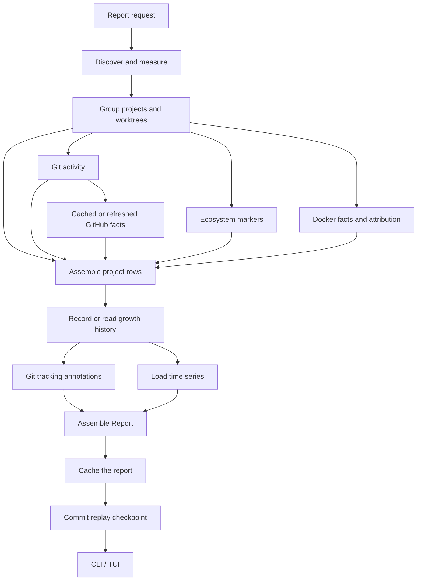

# Architecture

Swamp measures a development tree, attaches project context, and keeps observations for later comparison. Repeated use depends on three choices: retain enough state to reuse unchanged measurements, keep the history smaller than repeated full snapshots, and model the units a developer actually works with.

The CLI (interactive and its `--json` output for agent use) and TUI call the same report pipeline in `swamp-core`. This guide describes the implementation, including where work is still proportional to the full stored dataset.

## The data model

A report groups storage along these relationships:

| Entity | Identity and purpose |
|---|---|
| Project | Checkouts grouped by normalized `origin` remote; repositories without a remote fall back to their Git common-directory identity. |
| Checkout or linked worktree | A working directory and its Git context: branch, activity, tracking state, PR and merge facts. Worktree IDs are derived from paths. |
| Artifact | A classified unit such as build output, dependencies, cache, or Git metadata, attributed to the nearest containing worktree. |
| Directory or large file | Detail used for updates and growth inspection. Artifact interior directories are retained in storage but hidden behind the artifact row in the report. |
| Docker object | An image, volume, or build-cache record joined through explicit evidence, or reported as unowned. |
| Unowned row | Measured storage for which no project attribution was established, with a reason. |

Project grouping is implemented in [projects.rs](../crates/core/src/consumers/projects.rs). A linked worktree resolves its shared Git directory; a submodule resolves its own repository. Different clones with the same normalized remote share a project in the report. This is URL normalization, not server-side alias resolution: changing a remote URL or moving a worktree can change identity and split its history.

### Classification supplies context

The [ecosystem table](../crates/core/src/ecosystem.rs) associates markers such as `Cargo.toml` and `package.json` with artifact names. Ambiguous names such as `build`, `dist`, and `vendor` require a matching marker in their parent directory. Some names are recognized without a marker. A valid `CACHEDIR.TAG` also identifies a cache.

Classification supplies an artifact kind and ecosystem. It does not prove that everything inside a build directory is reproducible. The [harvest utility](../crates/harvest/src/main.rs) compares the table with vendored ignore and language lists; it reports candidates without editing the table. An ignore rule alone says nothing about whether the contents can be recreated.

Cargo reports retain profiles, role directories, individual incremental/build-script groups, identified test/example executables, and final executables/libraries directly inside each profile. Group sizes come from existing folded directory measurements; selected output files use shallow metadata reads. Cargo annotation does not recursively walk the build tree again. IDs are scoped to the canonical storage container, independently of project ownership. Trusted event coverage lets unchanged containers reuse these units. Only these units receive nested history; ordinary compiler files do not become report or history rows. Nested history does not inflate project totals. The small report cache is compressed; measurements and reverse deltas remain in Parquet. Dependencies remain a folded directory aggregate, not a per-crate size breakdown. Final outputs are currently inspection-only.

Folded groups show allocated totals, not an inferred reclaimable size. Subgroup hardlink attribution is unknown and displayed as such. Internal files can be inspected explicitly, but their past identities are not retained after deletion. This is a developer storage tool, not a filesystem audit log.

Path layout identifies profiles, dependencies, examples, build-script output, incremental state, and companion metadata. Existing Cargo fingerprints identify test executables and supply feature/compiler evidence where available. A fingerprint is not proof of last execution or obsolescence. Unknown variants stay unknown; historical compiler-message evidence does not establish freshness. Scanning never runs Cargo or build scripts.

Selective cleanup uses the existing plan, explicit approval, and ledger boundary. Supported selections are evidenced test/example executables with their dep-info/debug-symbol companions, or individual incremental/build-script directories. Execution holds existing Cargo profile locks and rechecks the selected group's role, fingerprint evidence, membership, identity, content, and occupancy—not the whole build tree. It then moves members into a same-filesystem Trash envelope with a restore manifest. Hardlinks do not prevent that move: unselected links remain intact, and reclaimable space stays unknown. The selected-group snapshot records link evidence without building a global alias inventory. Unsupported layouts, missing locks, and uncertain occupancy refuse cleanup. Locks are advisory: manual writers must be stopped. Shared dependency groups remain inspection-only.

Files outside classified artifacts are split into tracked, ignored, and untracked remainder buckets. The [ignore lens](../crates/core/src/ignore.rs) uses Git's index and exclude rules through gitoxide. Byte totals are apportioned using directory observations, with corrections for individually recorded large files. This preserves the measured total but is not an exhaustive per-file accounting of Git status.

### Attribution and recovery are separate

An image's source label or Compose metadata can associate it with a project even though it is stored by Docker. Similar names alone do not establish ownership. An unmatched object stays unowned.

Filesystem reconciliation separates attributed and unowned bytes. Docker has separate attributed and unowned totals, because daemon storage and shared layers do not map directly to the walked tree. The optional `--verify-du` result is an independent comparison; it does not establish that an entire volume, snapshots, or inaccessible paths have been accounted for.

### Build adapters are pluggable

Cargo was the only ecosystem whose build directory had an interior, and
the report pipeline called its identification by name. That is the shape
the agent side reached fourteen adapters with before anyone noticed it
was a fourteen-arm `match`, so the build side was given a trait and a
static registry before the second adapter existed rather than after the
fourth.

[`build_adapters`](../crates/core/src/build_adapters/) holds a
`BuildAdapter` trait, a static `Registry::with_builtins()`, a shared
`NestedUnitBuilder`, one capped manifest reader, and a checked
capability matrix. `consumers/cargo.rs` builds one identification
context and hands it to the registry; adding an ecosystem is one line
there and nothing else. An adapter references no other adapter (Gradle
and Maven share coordinate parsing through a neutral `jvm_common.rs`),
never traverses (structure comes from the folded walk's own rows or the
capped `locations::shallow_list`), never reads a whole file (only
`bounded_io::read_manifest`, capped at 256 KiB and counted), and never
spawns a process -- `npm ls`, `gradle dependencies`, `mvn
help:evaluate` and `cargo metadata` all evaluate the project's own build
definition to answer, and observation never runs the user's build.
Eight audits enforce those rules
(`.oh/guardrails/build-adapters-*.md`), each with rejection fixtures in
the mutation corpus.

The unit model is ecosystem-neutral. Cargo's roles (`profile`,
`incremental`, `build-script-output`) stay, and generic roles sit beside
them (`output`, `test-output`, `intermediate`,
`installed-dependencies`, `shared-store-entry`, `metadata`); both sets
map onto one small set of **role families** that aggregation and the
views group by. Every unit carries its accounting basis (allocated /
logical / unique-allocated / unknown -- never mixed in one total), the
source of its timestamp (a file's own `mtime`, a folded directory's
rolled-up newest entry, a time the tool recorded, or unknown), an action
capability, and a removal consequence in the ecosystem's own words.
Identity stays the unit's path inside its container, so a
reclassification changes no bytes and reaches no history as a delta.

Units are built through `NestedUnitBuilder` and only through it: its
defaults understate (unsupported, unknown basis, unknown time source,
inspection only), lifting one is a named method, and a later enrichment
re-opens the unit with `NestedUnitBuilder::amend` rather than writing a
field after `build()`.

Aggregation (`build_adapters::summarize_container`) counts nonempty
supported candidates only, stops at the outermost unit, never sums
across accounting bases, and reconciles to the container: unsupported
units and bytes no unit accounts for are an explicit residual, and
members exceeding their container is reported as unreconciled, never as
a zero residual. CLI text, `--json` (`interior`) and the TUI family
groups all read this one summary, and choose Cargo purpose groups or
neutral family groups by the roles the units carry, never by adapter id.

**Machine-wide stores.** A detector declares which of its locations are
build stores (`Detector::build_stores`, a `BuildStoreKind` with a
`StoreAnchor`), and an adapter declares which kinds it identifies
(`BuildAdapter::store_kinds`). `build_stores::containers_for` compares
the two declarations and nothing else; `external::observe_external`,
which already measures those locations, keeps the per-directory rows its
folded walk produces for a store whose units cannot be replayed, hands
them to the adapter, replays unchanged stores' units from
`associations/build_stores.parquet` under the same event window, and
records interior history on the `KeyFamily::BuildStore` rows of the
external current table, swept only inside stores it identified
(`.oh/guardrails/build-stores-join-by-capability.md`). The one
daemon-answered store, BuildKit, is joined the same way from the Docker
consumer's facts in the per-root pass (`BuildContainer::daemon_store`).

Reuse is gated on `fs_events::EventCoverage`, the same gate the agent
containers use, **and** on the stored units having been written by the
adapter that claims the container this pass (the claim depends on
marker files outside the container, which no event under it reports).
An unchanged container is replayed with zero listings and zero manifest
reads; a replay window that cannot say when it opened is not evidence
that nothing changed, and buys no reuse. A directory the walk cannot
list inside a container is recorded as an incomplete row and rolls
completeness up to every ancestor, so coverage gaps reach the units
instead of reading as a smaller tree.

Shared stores (a pnpm object store, an npm `_cacache`, a Gradle user
home, a Maven local repository, Go's and Python's caches, DerivedData,
the Android SDK) are joined in the external observation's own pass, as
described under "Machine-wide stores" above -- never from the per-root
build consumer, which would observe the same bytes twice.

`docs/build-artifacts.md` is the published capability matrix, checked
against the code in both directions.

## Cross-ecosystem decision contract

The reusable decision aid is **age + size + removal consequences**.
Cargo, Node, Gradle, Maven, Python, Go, Xcode/Swift, Android and
Docker/BuildKit supply it through the adapter registry; the capability
matrix states each family's layouts and attribution limits rather than
implying parity (a Go build-cache entry's key identifies nothing; a
BuildKit record's times are the daemon's).

Modification age is enough to recommend reviewing a supported generated-output or cache unit. It is not proof of obsolescence, and access time is not a prerequisite. Recent units remain reviewable; unknown or future timestamps must not look ancient. Unique data and active writers still require their specific protections. A recommendation never supplies deletion authority.

The responsibilities are separate:

| Layer | Contract |
|---|---|
| Identification and adapters ([#64](https://github.com/open-horizon-labs/swamp/issues/64), #66–#71) | Identify domain units, roles and membership independently of cleanup. Supply size/accounting basis, source-qualified timestamp and coverage, concrete removal consequences and prerequisites, and supported action granularity. Do not infer recoverability from names alone. |
| Aggregation ([#65](https://github.com/open-horizon-labs/swamp/issues/65)) | Summarize nonempty supported candidates: count, bytes on a common accounting basis, oldest known candidate modification time. Stop at an included removal group rather than counting its descendants again. Preserve unknowns and residuals; never label the oldest child timestamp as the category's last use. |
| Storage and incremental observation (#65, [#53](https://github.com/open-horizon-labs/swamp/issues/53)) | Reuse folded measurements, event invalidation, existing consumers and current + reverse-delta Parquet history. Retain compact unit-level measurements and source timestamps; derive age when displaying. Evidence refresh and passing time do not create byte-history deltas. No parallel database, exhaustive per-file index or giant artifact JSON cache. |
| Presentation and action ([#72](https://github.com/open-horizon-labs/swamp/issues/72), [#73](https://github.com/open-horizon-labs/swamp/issues/73)) | Show candidates and consequences in ordinary drill-down, including collapsed summaries. Rank older known candidates first, then size, with unknown age last. Exact selection, live checks and approval remain separate from read-only advice. |

Folded-group timestamp semantics must describe what was observed; a directory's own mtime does not establish every descendant's activity. Optional native last-use evidence remains separately labeled. Deeper attribution or membership inspection is bounded and on demand, not a second recursive walk on every refresh. Exact cleanup checks inspect only the selected groups. Allocated size is not a promise of freed space, and uncertain hardlink reclamation alone is not a reason to reject removal.

The planned validation covers mixed/unknown ages, overlapping groups, non-additive accounting, concrete consequences, evidence-only refresh, and unchanged/one-group-change latency and storage size. The purpose is useful developer cleanup decisions, not a perfect audit of historical use.

## Decision evidence contract (#53-#61)

Distinct from the section above (that one is the independent
build-artifact-identification epic, #64-#74): this is the catalog-wide
current-state evidence contract for artifact rows, external units,
agent-storage units and nested build-artifact units, implemented in
`crates/core/src/evidence.rs`.

`evidence::Evidence` is the shared shape: `kind` (`Activity`,
`Consumer`, `CurrentUse`, `Recovery`, `Reclaimability`), `subtype` (a
named finer-grained fact, e.g. `Modified` vs. `ToolReportedUse` within
`Activity`), `status` (`Known(value)` / `Unknown{reason}` /
`Unavailable{reason}` / `Conflicting{candidates,reason}`), `source`
(`EvidenceSource`, naming exactly what produced it, down to a file
path or tool name), `observed_at`, an optional `event_at` distinct from
`observed_at`, and a `Freshness` (an optional expiry for short-lived
facts, and/or a stated coverage limit). `Unknown` and `Unavailable` are
deliberately distinct: the former means the source was consulted and
had no answer, the latter means the source itself could not be reached
this pass (permission, daemon down, query timeout) -- collapsing them
would make "the query failed" indistinguishable from "checked, found
nothing".

Each domain has its own populating module, all pure/read-only and
reusing facts a pass already has in hand:

| Module | Domain | What it reuses |
|---|---|---|
| `activity.rs` (#54) | Activity | `ArtifactRow`/`ExternalUnit`/`AgentUnit`'s already-recorded `mtime_max`; `statfs` flags (macOS) / `/proc/mounts` (Linux) to detect `noatime`/`relatime` before ever trusting an access-time read; Docker's own `last_used`, kept as a separate fact from filesystem mtime |
| `occupancy.rs` (#55) | CurrentUse | `lsof` (existing `occupied()`'s underlying command, now also exposed as structured evidence distinguishing "no match" from "query failed"), already-collected Docker `ContainerRef`s, a non-blocking `flock` probe for manager lock files, and the bounded, allow-listed `xcrun simctl list devices -j` query (new `locations::ALLOWED_COMMANDS` entry) for simulator booted state |
| `toolchain_declarations.rs` (#56) | Consumer | Read-only parsers for `.tool-versions`/`mise.toml`, `.python-version`, `.ruby-version`, `.nvmrc`/`.node-version`, `rust-toolchain(.toml)`, rustup's global `default_toolchain`; matched against measured installations with manager semantics (an alias/range like `lts/*` or a bare `3.12` stays an explicit unresolved range unless exactly one installation uniquely matches); `resolve_rustup_channel_to_dir` widens a bare channel (`stable`) to its one installed `<channel>-<host-triple>` directory only when unambiguous |
| `external_associations.rs` (#57) | Consumer | Xcode DerivedData `info.plist`'s `WorkspacePath` (read via the bounded, read-only, output-only `plutil -convert xml1 -o -`, never a bespoke binary-plist parser) joined against known project roots; dependency-lockfile identity parsers (`Cargo.lock`, `package-lock.json`, `pnpm-lock.yaml`, `go.sum`, `gradle.lockfile`, `pom.xml` via the `roxmltree` dependency -- `parse_pom_xml_with_gaps` returns both the resolved identities and the ones it could not resolve, such as a `${property}` or parent-inherited version) joined by exact name+version; targeted existence-check joins (`cargo_registry_entry_exists`, `go_module_cache_entry_exists`, `gradle_cache_entry_exists`, `maven_repo_entry_exists` -- one `Path::exists()` hash lookup per declared identity, never a store enumeration); `docker_join_evidence` normalizes the existing Docker join decision (compose label, image-source label, worktree-path label) into this same contract |
| `recovery.rs` (#58) | Recovery | Worktree presence (rebuild), lockfile presence (network fetch), a Maven local repository (the **limit**, not a classification: swamp never reads the per-artifact `_remote.repositories` marker, so the whole tree's recovery fact is `Unknown` with that limit stated -- `maven_artifact_recovery` is called with `false` at its one production call site, `actions.rs::external_recovery_facts`, and `docs/locations.md` says the same), a known toolchain version string (local reinstall), Docker image/build-cache/volume context (`docker_image_recovery` names pull-vs-rebuild as two candidate, never-picked-for-you prerequisites; `docker_build_cache_recovery` requires a present joined worktree; `docker_volume_recovery` is always potentially-unique local state with no Trash); every assessment states its unresolved unknowns and a concrete follow-up check, never a fabricated cost or an assumed backup |
| `reclaimability.rs` (#59) | Reclaimability | `ArtifactRow`'s already-measured `bytes`/`hardlinked`/`dedup_stale`; separates logical vs. allocated vs. estimated-reclaimable (`Known`/`Bounded`/`Unknown`, bounded rather than exact for APFS clones/snapshots and unresolved hardlink membership) vs. observed post-action free-space change (`actions::free_space_bytes`, a real `statvfs` reading before/after); `estimate_selection` reconciles a selection set's shared inodes so the same physical storage is never summed twice, and `actions::propose*` carries its result on the `Plan` as `selection` next to the plain `planned_bytes` sum |
| `consumer_wiring.rs` (#56/#57 live wiring) | Consumer | The caller that actually runs the two modules above against real worktrees/external units: a per-worktree mtime-keyed cache (`assoc_store.rs`'s toolchain-declarations/dependency-identities current-state Parquet tables under `${SWAMP_DIR}`, mirroring `external.rs`'s existing `external_consumers.parquet` precedent) so an unchanged worktree's declaration/lockfile files are never re-parsed; attaches consumer evidence both ways (an installation/shared-store `ExternalUnit` <- every project declaring/depending on it; a project's own `Source` row -> the installations/dependencies it declares); a rustup `settings.toml` global default gets its own role, distinct from any project's declaration; Xcode DerivedData subfolders are enumerated (one `plutil` read per subfolder) and joined by `WorkspacePath` |

Attachment point: `report::attach_decision_evidence`, called exactly
once from `bus::run_report` -- the single choke point every report
caller (CLI text/JSON, TUI, single- and multi-root) goes through --
populates every `ArtifactRow.evidence` with Activity, Reclaimability
and (for `BuildOutput`/`DependencyTree`/`Cache`/`DockerImage`/
`DockerBuildCache`/`DockerVolume` kinds) Recovery facts. Activity is
two facts, not one: the folded walk's own `mtime_max`, plus the unit's
own anchor-path access time (one extra `stat` and one `statfs` per
row -- never a per-file pass), which on a `noatime`/`relatime` mount is
an `Unavailable` fact naming the mount option rather than an omitted
question. A Docker row is excluded from anything that stats a path: its
"path" is a repo tag, image id or volume name the daemon owns.
Reclaimability's estimate is a bound rather than an exact figure
whenever hardlink membership is unresolved *or* the row sits on a
copy-on-write volume, where a clone or snapshot outside the unit can
retain every extent.

The Docker-join site in `report.rs` and `external::discover_and_measure`
attach Consumer facts from data they already collected; a Recovery
assessment's own `follow_up_check` ("the smallest useful check") is
carried into the attached `Evidence::note` rather than dropped, so it
survives into every presentation surface that already renders `note`
(CLI text, the TUI detail area, JSON). That same Docker-join site
attaches the two facts only the raw `docker::DockerFacts` can answer --
the daemon's own `last_used` on a build-cache row (Activity,
`ToolReportedUse`) and its running-container references on an image or
volume row (CurrentUse, `RunningContainer`) -- to joined and unjoined
rows alike, since "no project claims it" is a consumer fact rather than
a reason to drop the object's own evidence.

No `CurrentUse` fact that requires a *live* query is attached during a
passive report (a process, lock, container-state or booted-device check
is short-lived, and one query per detected unit on every report is a
cost identification must not pay): `actions::plan_unit_evidence` takes
the `lsof` reading fresh when a `PlanUnit` is built,
`actions::unit_from_external` takes an external unit's manager-lock and
simulator-booted readings there too. This reading is shown on the TUI's
confirm banner as a fact, never as a veto (2026-09-23: there is no
execute-time recheck any more to take it "again"; see below).

`consumer_wiring::attach_associations(report, external_units, swamp_dir)`
is called once per call site that has *both* a computed `Report` and a
computed `Vec<ExternalUnit>` in hand at the same time -- the CLI's
`report --view external`/unified `propose` routes and the TUI's
startup -- mirroring how `agents::discover_and_measure` already takes
`project_worktrees` from an already-computed report rather than
re-walking anything. It cannot run inside `bus::run_report` itself:
external units are not part of `Report` (see `external.rs`'s own module
doc), so the join needs both objects already built.

Cost discipline: every population step above is O(rows) arithmetic
over numbers the walk/measurement pass already produced, or one
bounded query per *proposed* unit (never per file, never per report
row for `CurrentUse`) -- see `crates/core/tests/evidence_contract.rs`'s
`refreshing_evidence_never_writes_byte_history_delta`, which asserts
two observations with nothing changed on disk produce byte-identical
`bytes`/`growth_bytes`/`regrowth_count`, and that calling
`attach_decision_evidence` again on an already-annotated report changes
nothing. `consumer_wiring`'s own cost shape: a handful of
`fs::metadata` calls per worktree per report to build a cheap
fingerprint (a full re-parse only on a fingerprint change), and a
`Path::exists()` hash lookup per declared dependency identity against
its ecosystem's shared store -- never an enumeration of the store's
contents.

Human keep/protect intent (`swamp protect`, previously effective only
for agent-storage units) is extended to ordinary artifact rows via
`actions::propose_checking_protection`: a protected path is refused at
proposal time with a named cause in `plan.refused`, never silently
dropped or silently left plannable. Only `agents::protect_add`/
`protect_remove` (reachable only from the CLI's own `protect`
subcommand) can change the underlying list -- a scanned project file or
an agent's own observation cannot.

Presentation (#60): `render::render_evidence_lines` (CLI text,
`render_view_external`) and the TUI's `ui::draw_body` detail area (the
selected row's own evidence, ordered activity/consumer/current-use/
recovery/reclaimability so a short terminal clips the least
decision-relevant lines first, sized by estimated wrapped-row count so
a long fact list never silently overflows its allotted height) both
read `model::Row::evidence`/`ArtifactRow`/`ExternalUnit`/`AgentUnit`
evidence directly -- no separate presentation-only data path. The
inline confirmation row (`app::mark_row`'s `warnings`, shown in
`actions::confirm_summary`) adds `render::evidence_warnings(&row.evidence)`
next to the pre-existing git-status warnings: a selective filter (a
declared consumer, current use, an uncertain recovery/reclaimability
fact), never every fact restated as a warning. JSON: the default report
view, `--view external`/`--view agents` (whole structs through serde)
and now the bespoke-shaped `kinds`/`builds`/`deps`/`unowned`/
`worktrees`/`docker` views (`agent_json::view_payload`/
`docker_objects_payload`/`list_worktrees_payload`) all carry `evidence`
per row -- a `kinds` bucket (no single row backs it) carries the
concatenation of every underlying row's evidence; a `worktrees` row
carries its own `Source` row's evidence, the same lookup the TUI's
`tree_rows` uses.

Known gaps, named rather than silently absent: `uv`/Conda project-level
declarations (#56's own "where source metadata establishes them"
qualifier) have no parser in `toolchain_declarations.rs` yet, so
`consumer_wiring` cannot wire what does not exist; pyenv/rbenv/nvm/
asdf/mise global defaults are not read (only rustup's `settings.toml`
is -- the only manager `toolchain_declarations.rs` already had a
global-default parser for); npm's cacache and pnpm's content-addressed
store cannot be matched to a specific declared name+version (stated as
`Unknown`/a coarse per-worktree-declared fact respectively, per #57's
own acceptance criteria); a Gradle/Maven artifact's downloaded-vs-
locally-installed distinction needs the per-artifact
`_remote.repositories` entries; the Maven build adapter reads them
(bounded, per version directory the folded walk already listed) when it
identifies a repository container, but machine-wide stores are not yet
joined into the report pass (see the build-adapter section above), so
the *external* recovery fact for a Maven store is still `Unknown` with
that limit named, per `docs/locations.md`'s row; a
custom (non-default) `GOMODCACHE`/pnpm per-volume store is identified
via its documented sibling-directory shape, not guessed, but an
unconventional override could still miss.

## Effective scope and location detectors

Before any observation, swamp resolves *which roots to look at* -- a
separate concern from the observation pipeline below, which decides how
to walk a chosen root. [`crate::scope::resolve_effective_scope`](../crates/core/src/scope.rs)
is a pure function: given an [`Environment`](../crates/core/src/locations/mod.rs)
(home directory, env vars, platform, and an optional command runner),
a `ScanConfig` (the `[scan]` table), any explicit command-line roots,
and a detector [`Registry`](../crates/core/src/locations/mod.rs), it
returns an `EffectiveScope` -- never touching the filesystem except a
single, non-recursive presence/readability check per candidate root.
Every scope-resolving CLI command (`scope`, `report`, `observe`, `ui`,
`schedule`) calls this one function; none of them recomputes scope on
its own. See [Scope and coverage](usage.md#scope-and-coverage) for the
user-facing behavior this produces.

### Scope authority: only `scope.rs` interprets detector output

A detector proposes candidates. Whether a candidate is *in scope* is
decided in exactly one place, and everything downstream is told the
answer rather than re-deriving it.

`EffectiveScope::authorized_roots()` returns `(authorized,
unauthorized)`: roots this pass may look at, each carrying its
detector's id, display name, category and provenance plus any exclusion
patterns inside it; and roots the scope considered but did not
authorize, each with a reason and a flag distinguishing *deliberately
out of scope* (excluded, disabled detector, outside an explicit command
root) from *in scope but not observable* (missing, unreadable). Only the
second is a coverage gap.

`external::discover_and_measure_in` and `agents::discover_and_measure_in`
consume that. Neither can read raw detector output: `DetectorSummary`'s
candidate locations are private to `scope`
([capability gates](#capability-gates)). The 2026-09-21
review found both of them iterating raw `Resolved` detector candidates,
which is detector *output*: an exclusion, a disabled detector and
explicit-root replacement could not reach them, so excluding a tool home
outright still produced units for it.

Explicit command roots replace inferred ones. Under `--root`, a
detector-proposed path is authorized only if it lies inside an explicit,
present root (`authorized_detector_paths_in_explicit_roots`). The CLI
and TUI pass their explicit roots into scope resolution rather than
re-resolving with an empty list, which is how `swamp ui <one-project>`
used to widen itself back out to the whole configured catalog for
external and agent discovery.

`defaults = false` means explicit-only scope, with an
`enabled_detectors` allow-list for turning individual detectors back on;
`detectors_permitted` is the single predicate that decides whether
detector inference runs at all. See
[explicit-only-scope-when-defaults-false](../.oh/guardrails/explicit-only-scope-when-defaults-false.md).

Precisely what `detectors_permitted` reads as "explicit", because the
two config lists differ and the difference matters:

- `enabled_detectors`, when non-empty, is an **allow-list**: only those
  detectors run.
- `disabled_detectors`, under `defaults = false`, is a **deny-list**:
  the catalog minus the named ones. Naming what you do not want is
  itself an explicit statement about the rest, and the reviewer's own
  fixtures rely on this reading.
- Neither list set, with `defaults = false`, is an empty scope, and
  every command says so rather than falling back to the current
  directory.

All three are pinned by name:
`scope.rs::tests::defaults_false_without_includes_or_enabled_detectors_is_empty`,
`defaults_false_with_only_disabled_detectors_still_runs_the_rest`, and
the reviewer's `defaults_false_must_mean_explicit_only`. `docs/usage.md`
says the same thing to a user, including which list to reach for if you
want the strict reading.

`Detector::default_enabled` (stack/26) is the third axis, independent of
`defaults = true`/`false`: a detector can opt out of ordinary
`defaults = true` scope on its own, for a **system-wide install tree**
whose store is not per-user -- currently only Homebrew
(`/opt/homebrew`/`/usr/local`, shared by every account on the machine).
`locations::permitted::PermittedDetectors::from_config` folds this in on
the `defaults = true` branch only (the `defaults = false` branch is
already fully explicit, so a detector's own default plays no part
there): a default-off detector not named in `enabled_detectors` joins
`disabled`, and is also recorded in the new `default_off` subset so
`swamp scope` can report `disabled (default off)` instead of a plain
`disabled` that would read as the user's own choice. `enabled_detectors`
is therefore read two ways depending on `defaults`: an allow-list under
`defaults = false`, and "also turn on this default-off detector" under
`defaults = true` -- one config key, not two, because the two scan
modes never both apply to the same invocation.

### Observation ownership: who may tombstone a row

External units and agent units share one key family in one Parquet
current table -- one store, one key scheme, two granularities. That
sharing is deliberate, and it means neither observation may assume a key
it did not see has disappeared.

`growth::ObservationOwnership` carries a `KeyFamily` (external or agent)
and the roots that observation covered *completely* this pass. The
tombstone loop in `observe_and_annotate_external` is guarded by
`ownership.owns(key)`: the row must belong to this family and lie inside
a covered region. A root that was excluded, whose detector was disabled,
that was missing or unreadable, or that simply was not part of this pass
contributes no covered root, so nothing under it can be marked absent.

`report::observe_scope` runs the walk, external discovery and agent
discovery as one pass, so the ordering question does not arise either.
Before this, running them in sequence over an unchanged filesystem had
each tombstoning the other's rows, and the next pass reported the
resurrection as regrowth. Coverage changes are not storage changes.

### `swamp report` is a pure read; `swamp observe` is the only scanner (R12, 2026-09-24)

Two entry points, one direction of data flow: `swamp observe` is the
only command that walks a filesystem, stats a header, or spawns a
subprocess (`du`, `gh`, `docker`). It runs the full pipeline above --
walk, project grouping, signals, evidence, external + agent discovery,
GitHub/Docker enrichment -- through `report::observe_scope` with
`ObservationParts::ALL`, and, on a pass that observed and persisted both
unit families successfully, writes the scope-wide fact tables below
under `report::scope_snapshot_key`. `swamp report`
(`report::report_scope_from_store`) does the reverse: resolve the scope
(a config read plus one presence `stat` per candidate root, never a
recursive walk), compute its key, rebuild the facts from the tables,
and *derive* every view from them. No walk, no unit discovery, no
subprocess -- CLI rendering (`render.rs`, `agent_json.rs`) runs
unchanged over the result. A scope with no `runs.parquet` row is not an
error to paper over: text prints `no observation yet for <scope>; run
swamp observe` and exits 2; JSON prints
`{"error":"no_observation","scope":...}`. `--since` belongs to
`observe` -- growth/regrowth are fixed at the observation that computed
them, from whichever window that pass used (`runs.parquet` records it);
`report` has no `--since` of its own. `--no-observe` is gone from every
command; `--full`/`--docker-facts`/`--verify-du`/`--enrich` belong to
`observe`. The TUI's instant paint on startup reads the same tables
(`swamp_tui::run`), and its background refresh calls `observe_scope`
exactly as before; `observe_scope`'s narrowed per-root live-watch
refresh (`ObservationParts::WALK_ONLY`) does not write the scope-wide
tables -- persisting a partial pass under the whole scope's key would
drop the unit families the last full pass had.

#### Store = facts, report = view (R20, 2026-09-24)

`.oh/guardrails/store-is-facts-report-is-views.md`. The store holds
observation facts and their history; every `Report` field that is a
function of them is computed by `growth::derive_report_views`, last in
`report_scope_from_store`, with the same functions the observe pass
used (`report::summarize`, `growth::history_series`,
`growth::annotate_readonly*`, `report::attach_allocated_from_dirs`,
`report::merge_series_into`, `report::sort_drill_down`), at the
observation's own `observed_at`. A read is therefore byte-identical to
the pass that wrote the facts (`crates/core/tests/report_is_a_pure_read.rs`,
`derived_views_are_computed_not_stored.rs`), and there is no second
copy of anything to disagree. The audit
`parquet_writers_are_the_named_fact_tables` keeps the table set closed:
the one Parquet writer is reached only from the named fact-table
writers, and `crates/core/tests/store_contents_are_allowlisted.rs` holds
the same list by file name.

Derived at read time, never stored: `Report.summary` (a fold over the
project rows), `reconciliation` (the walked roots' totals summed),
`series_by_key`/`total_series`/`series_window_secs` (the volume
histories bucketed at `observed_at` over the run's window), `unowned`
(each walked root's `unowned.parquet` then `docker_unowned.parquet`, in
scope-root order), `dirs_by_worktree`/`files_by_worktree`
(`dirs.parquet`/`files.parquet` with growth from their history,
tracking from `dir_tracks.parquet`, interior rows of folded artifacts
removed, sorted by relative path), and each artifact's `growth_bytes`/
`regrowth_count`/`allocated_bytes`/`allocated_growth_bytes` (its
history and its measured directory row). The tables R17-R18a-3 had
given these (`summary.parquet`, `series.parquet`,
`unowned_summary.parquet`, `worktree_entries.parquet`,
`github_enrichment.parquet`, growth columns on `artifact_shape.parquet`)
are gone.

Two things are stored although they look derived, because a read cannot
recompute them: a nested artifact's cleanup guidance (computed once from
`observed_at`, so a stored observation renders identically -- the
render-time clock read it replaced made `report --json`
non-reproducible), and the git tracking state of a walk's top-level
directories (`.gitignore` is read by the walk; a report never opens a
file under a worktree).

**The fact tables.** Scope-wide tables live at `<store>/` and are keyed
by `scope_key`, replaced wholesale per key by the pass that produced
them; per-volume tables live at `<store>/<volume>/` (one directory per
root-scoped volume id) and are replaced or appended per root.

| table | one row per | what it records |
| --- | --- | --- |
| `runs.parquet` | scope key | the last all-family pass: observation parameters, enrichment counters and scheduler status; nullable unique-byte reconciliation total, timestamp and needs-reconciliation flag. Its row is the "observed at all" marker. |
| `coverage.parquet` | scope root, or authorized unit root | `class` (`project`/`detector`), `status` (the bare `RegionStatus`/event-covered tag), `reason`, `mode`, `cursor_family`; for a walked root its own totals: `walked_total`, `projects`, `attributed`, `unowned`, `du_total`, `docker_attributed`, `docker_unowned` (all nullable). |
| `notes.parquet` | note | the run's diagnostics (fsevents mode, daemon reachability, GitHub notes), `seq`-ordered. |
| `projects.parquet` / `worktrees.parquet` / `worktree_facts.parquet` | project / worktree / signal or merge-complete term | a project's and worktree's own scalars (name, ecosystems, remote, path, kind, branch, idle, the `GithubFacts` scalars flattened under `github_`), and the two list-valued facts (`fact_kind` = `signal` \| `merge_complete_term`, `seq`). |
| `artifact_shape.parquet` (+ `_lists`) | artifact of a worktree, `seq`-ordered | `kind`, `rel_path`, `track`, `confidence`, `source_tool`, `note`, `created_at`, `dangling`; `containers`/`shared_with` in the child table. Bytes/mtime/hardlink/dedup/regrowth/ecosystem come from the volume's current-artifact table. |
| `external_units.parquet` / `agent_units.parquet` (+ `unit_consumers`, `agent_unit_members`) | external or agent-tool storage unit | the unit's identity, bytes, completeness, provenance, linkage, protection, `tool_home`/`relative_path`/`action`; declared consumers and member paths in the child tables. |
| `nested_artifacts.parquet` (+ `_lists`, `_evidence`) | nested build-artifact unit, per `origin` (`report` \| `store-interior`) | every `NestedArtifact` field, including the variant details and the cleanup guidance computed at observe time; coverage limits/variant unknowns and producer/consumer evidence in the child tables. |
| `evidence.parquet` | `Evidence` entry | every entity's decision evidence, keyed `"<entity_kind>:<id>"` (artifact, external/agent unit, nested artifact). |
| `protect.parquet` | protected path | the human keep list (`path`, `added_at`). |
| `<volume>/current.parquet` + `deltas/` | artifact row | the current-artifact table (`kind`, `rel_path`, `bytes`, `local_bytes`, `mtime_max`, `hardlinked`, `dedup_stale`, `regrowth_count`, `ecosystem`, `observed_at`) and its reverse deltas -- the growth history. |
| `<volume>/dirs.parquet` + `dirs_deltas/`, `<volume>/files.parquet` + `files_deltas/` | directory / large file | allocation, counts, `mod_time_min`, completeness, and their history. |
| `<volume>/unowned.parquet` (+ `_lists`, `_evidence`) | unowned/remainder row of the walk | path, bytes, reason, Docker/shared facts; containers/shared-with and evidence in the child tables. |
| `<volume>/docker_unowned.parquet` (+ `_lists`, `_evidence`) | Docker object no project claims | the rows the gate joined after the walk's checkpoint, same three-file shape. |
| `<volume>/dir_tracks.parquet` | top-level worktree directory | its git tracking state as the walk read it. |
| `<volume>/topology.parquet` | worktree | the incremental walk's own topology comparison (`worktree_id`, `project_id`, `path`, `kind`, `remote_url`, `device`). |
| `external/folded/<id>.parquet` | directory of one external unit (one file per unit, `entities::id_for(unit_path)`) | the folded measurement cache an unchanged root reuses under an event window. |
| `external/volume_stamps.parquet` | read-only filesystem mounted under a unit root | its `statfs` stamp (device, block totals) and what the last walk found -- reused without a walk or a window while the stamp holds (sealed simulator runtime volumes; R19). |
| `<volume>/enrich.parquet` | worktree | the GitHub enrichment fetch cache. |
| `git_signals.parquet` (+ `_values`), `cargo_replay_cache.parquet` (+ `_lists`, `_evidence`, `_meta`) | root | the per-root replay caches (`consumers/signals.rs`, `consumers/cargo.rs`) for an unchanged worktree/container, keyed by `growth::root_key`. |
| `build_stores.parquet`, `xcode_derived_data.parquet`, `declarations.parquet`, `dependency_identities.parquet`, `external_consumers.parquet`, `agent_identifications.parquet`, `agent_containers.parquet` | store / product / declaration / identity / consumer / session | the association caches (`assoc_store.rs`) the consumers join on. |
| `<volume>/cursors.parquet` | replay-anchor family (`walk`, `unit_root`) | the FSEvents event id, device, observation time and rules version the next incremental pass replays from (R18b; was `fsevents.json`). |
| `docker_meta.parquet`, `docker_images.parquet`, `docker_build_cache.parquet`, `docker_volumes.parquet`, `docker_builders.parquet`, `docker_values.parquet`, `docker_containers.parquet` | daemon answer / image / cache entry / volume / builder / list or label value / container reference | the Docker daemon's cached answer with its `cached_at` (the TTL's clock) -- R18b; was `docker_facts.json`. |
| `scope.parquet`, `scope_values.parquet`, `scope_roots.parquet`, `scope_root_reasons.parquet` | resolution / list value / root / reason | the last resolved effective scope, for the next run's coverage-change note (R18b; was `scope.json`). |
| `scheduled_runs.parquet` | the last scheduled run | its outcome, mode, wall time, walked total and project count, for the report header and `swamp schedule` (R18b; was `last_run.json`). |
| `ledger.parquet` + `ledger_facts.parquet` | recorded action / fact shown on its confirm line | "where did it go": verb, entity, actor, outcome, recovery location, and the typed facts the human saw (R18b; was `ledger.jsonl` with a JSON evidence blob). |
| `continuity/<id>.parquet` + `<id>_entries.parquet` | a Linux collector's checkpoint / its dirty or excluded path | the collector's epoch, loss records, counters and dirty set (#82; R18b, was `<id>.json`). |

Column-level history of how each table arrived (R14-R18a-4) is in
`.oh/sessions/2026-09-24-r1*-*.md`; the tables are what they are today.

### There is no recheck model at a destructive sink any more (retired 2026-09-23)

`crate::recheck` and `crate::authority` are deleted along with the CLI
action path. `fs_gate::destroy::trash_move`/`Envelope` take a plain
path or member list and move it; the only refusal is an OS-level error.
Human keep/protect intent is still checked, but at mark time, in the
TUI (`app.rs`'s `mark_row`, which reloads `agents::load_protect` fresh
before adding anything to `self.marked`) -- not re-checked again before
Enter. Occupancy (`occupancy::probe_path`/`probe_paths`) is still
computed and shown on the confirm banner as a fact, never as a gate.
`cargo_cleanup::move_group` still holds the Cargo build lock for the
duration of its move (mutual exclusion with a concurrent `cargo build`,
not a "did anything change" check) but no longer digests members'
contents or refuses on a changed fingerprint.

### Incremental measurement, and what is still a full pass

`folded_measurement` is the single seam that turns a unit into bytes, so
there is one implementation to make incremental and one place the work
counters live. `crate::work_counters` counts directory listings, stats
and header bytes; `crates/core/tests/incremental_external_and_agent_measurement.rs`
reads them over a 5,000-session agent home and a 20k-file cache root, so
"unchanged work is cheap" is a number rather than a claim.

`agents::bounded_io` is the only way an adapter may read file contents,
capped at `MAX_HEADER_BYTES`. The association layer's caches
(`assoc_store`) are Parquet current-state tables keyed by identity plus
a source fingerprint, so an unchanged worktree is a table lookup and an
unchanged Xcode DerivedData folder costs no `plutil` subprocess.

**The agent identification cache** is the fifth of those tables
(`assoc_store::IdentificationTable`), reached through
`agents::IdentifyCtx::derived`. An adapter asks for a *derived value* --
a session's declared `cwd`, a task's workspace path -- rather than for
bytes, and the value is memoised against the source file's own identity.
Measured on the 5,000-session fixture: the first pass reads 740,000
header bytes, an unchanged second pass reads **0**, and appending one
session costs one capped read and exactly one cache miss
(`crates/core/tests/incremental_external_and_agent_measurement.rs`,
which asserts the strict `== 0`).

That fingerprint is `(len, mtime_ns, ctime_ns, inode)` plus
`agents::ADAPTER_VERSION`, not `(size, mtime_secs)`. Two independent
adversarial passes over the first version found the same hole: rewriting
a session's declared `cwd` to a path of the *same length* within the
same wall-clock second left size and whole-second mtime unchanged, so
the stale project was served and a re-linked session never moved. A
cache that cannot see a same-second, same-size rewrite silently lies,
and the only reason the unit tests missed it was that they slept a
second first. `agents::mod::tests::a_same_second_same_size_rewrite_invalidates_the_cached_derivation`
has no sleep, on purpose.

Execution-time rechecks run with `IdentificationCache::disabled`, so an
approval is never spent against a cached derivation
(`agents::reidentify_for_tool`).

What is *not* yet incremental, measured rather than asserted: an
unchanged external root is still folded afresh on every pass. The work
counters make that visible (`dirs_listed`, `files_statted`) and
`an_unchanged_external_cache_root_is_not_re_traversed` pins that the
work is at least counted.

### Location detector registry

A detector proposes candidate storage locations for one developer tool
(Cargo, rustup, Homebrew, ...). It is deliberately **not** an
`EventBus` consumer: the bus's consumers react to walk events for an
already-chosen root, and a detector's whole job is deciding which roots
to walk in the first place -- there is no walk in progress yet for it
to subscribe to. What a detector *does* borrow from the bus's
discipline (see "Observation pipeline" below and
[extractors-are-pluggable](../.oh/guardrails/extractors-are-pluggable.md)):
static registration (`Registry::with_builtins`, mirroring
`EventBus::with_builtins`), no detector knows about another, and
`crate::scope` never special-cases the walk or report assembly for a
new detector.

Adding a detector is one small file plus one line of registration.
Copy an existing one under [`crates/core/src/locations/`](../crates/core/src/locations/)
-- `cargo_home.rs` for a single env-var-or-convention root split into
several categorized sub-locations, or `homebrew.rs` for a detector that
also runs one bounded, read-only, allow-listed tool query -- then add it
to `Registry::with_builtins`. Every detector:

- Declares a stable `id()` (used in `disabled_detectors` config and in
  `EffectiveScope` provenance -- never reused for a different meaning
  once released), the `platforms()` it applies to, and a
  `version_note()` for `swamp scope` output and this doc. A detector
  proposing a system-wide install tree (not per-user -- currently only
  Homebrew) overrides `default_enabled()` to `false`, so it stays off
  under ordinary `defaults = true` scope until `enabled_detectors`
  names it.
- Returns `ProposedLocation`s carrying a `StorageCategory`
  (installation/downloads/cache/local-state/environments/build-output/
  models/unclassified), a `Provenance` (built-in convention, env var,
  config field, or tool query), and a `LocationStatus` (resolved,
  not-present, disabled, or unresolved-with-reason) -- never a bare
  path with no explanation of how it was found.
- Never executes shell startup files, project scripts, plugins, or
  package-install commands. A tool query is optional, must appear on
  the detector-wide `ALLOWED_COMMANDS` allow-list, is bounded by a
  timeout, and its failure is reported on its own `ProposedLocation`
  entry (`UnresolvedWithReason`), never fatal to the rest of detection.
  A convention-path proposal does not depend on the tool query
  succeeding or even running, so a leftover cache is still found after
  the tool itself is uninstalled.
- Never authorizes measurement, attribution, or removal. Discovery
  (this registry) is strictly upstream of measurement (the observation
  pipeline), attribution (project/worktree linkage), and deletion
  eligibility (grants/actions).

`crate::scope` folds detector output into scope: it deduplicates two
detectors resolving the same normalized path (retaining every
reason/provenance), applies `disabled_detectors` (and, for the
built-in-defaults detector specifically, `defaults = false`) before
calling `detect()` at all, applies `exclude` after resolution, and
folds a root that is a subdirectory of another in-scope root into its
parent for measurement while retaining the fold as an inclusion reason
on the parent. Tests never scan the real home directory: `Environment::fixture`
takes an explicit home/env/platform and a `NullCommandRunner` by
default (any tool query fails loudly rather than silently reaching a
real binary on the test machine); `FakeCommandRunner` records every
call it receives so a test can assert a detector only ever asked for an
allow-listed, read-only command.

## Multi-root observation and coverage

`crate::report::report_scope` (#42) is the one coherent entry point over
a resolved `EffectiveScope`: it iterates every candidate root, walks
each `Present` one through the ordinary single-root pipeline below, and
returns a merged `Report` plus one `crate::coverage::RootCoverage` row
per root. `report`/`observe`/`ui` all go through it when no explicit
root is given; `observe`/`schedule` already looped over every present
root before this chunk (this is the CLI's callers converging on one
shared function, not a change to how any single root is walked).
`report_scope_with_parts` (#51) is the same call with one more return
value: every present root's own single-root `Report`, keyed by its
walked path, alongside the merged one -- what `swamp_tui::run_scope`
needs so a later live refresh can replace one root's contribution
(`report::merge_root_report_into`/`merge_reports`) without re-walking or
re-merging every other root. `report_scope`/`report_scope_with_source`
keep their original two-value return for every existing caller;
`report_scope_with_parts` is additive, not a breaking change to either.

Two design choices are load-bearing here, both direct responses to the
guardrail
[coverage changes are not storage changes](../.oh/guardrails/coverage-changes-are-not-storage-changes.md):

- **Physical stores stay per-root**, keyed exactly as before
  (`growth::root_scoped_volume_id`: device + canonical root path).
  `report_scope` is a coherent *orchestration* layer, not a merged
  store -- two roots can never corrupt or overwrite each other's
  current/delta files, because they are never the same files. The
  alternative (one store per resolved scope) would need a materially
  more complex tombstone sweep to avoid exactly the hazard this issue
  exists to close (a root dropped from scope looking like a mass
  deletion); keeping per-root stores makes that hazard structurally
  unreachable instead of merely guarded against.
- **A root is re-checked for read access immediately before it is
  walked**, not only at scope-resolution time: `fs::read_dir` on a
  `Present` root, right before calling into the pipeline. Scope
  resolution and this call are never atomic, and a permission-denied
  root's walk used to look exactly like "this root has zero projects",
  which fed straight into the growth store's "present before, absent
  now -> tombstone" sweep. A `RootCoverage::Inaccessible` region is
  recorded instead, and the pipeline is never invoked for that root at
  all -- its store is completely untouched.

A related, narrower hazard lives one level down: a single root can stay
readable overall while one *worktree inside it* loses access (a project
directory chmod'd, not the whole root). Discovery for that worktree
simply stops finding it -- indistinguishable, at the `discovered: Vec<DiscoveredWorktree>`
level, from the worktree having been deleted. `growth::compute_unconfirmed_worktrees`
closes this: after a walk (full or incremental), it diffs the new
`discovered` list against the previous observation's stored topology,
and for every worktree that dropped out, stats its stored path directly.
`ENOENT` is real deletion (tombstoning is correct: it can regrow for
real when it comes back). Any other outcome -- the path exists but
cannot be `read_dir`'d -- means access was lost, not the worktree; its
id goes into `TrackedWalk::unconfirmed_worktree_ids`, threaded through
the bus (`Event::RootObserved` -> `ProjectsGrouped` -> `Draft::protected_worktree_ids`)
to `growth::observe_and_annotate`, whose tombstone sweep skips every
row belonging to a protected worktree id even though it is absent from
this pass's `seen_keys`. `external.rs` applies the identical distinction
to external units (see below), and `walk::resize_artifact`/`process_walk`'s
own permission-denied handling (recording an `UnownedRow`, never
crashing) is what makes the underlying `fs::read_dir` failure legible in
the first place.

Exclusion pruning works the same way at the walk level:
`EffectiveScope::pruned_subtrees` (recorded by scope resolution, #41)
is consumed by `walk::discover_one`/`process_walk`
(`discover_parallel_excluding`/`attribute_parallel_carrying`'s
`excluded` parameter, threaded through `Ctx::pruned_subtrees` ->
`growth::stage_tracked_with_source`): a directory at or under a pruned
path is never entered by either the worktree-discovery pass or the
attribution pass, so it is not measured, not reported as unowned, and
not present in `discovered` at all -- `Excluded`, never `Partial`. The
incremental path reaches the same result by filtering FSEvents'
`changed_dirs` against the same list before any re-walk primitive
(`apply_incremental`, `discover_shallow`, `attribute_one_worktree`) is
invoked, rather than teaching each of those smaller entry points their
own exclusion list.

## External and shared storage units

`crate::external` (#43) turns every detector location (every root for
which `ScopeRoot::is_project_root()` is false -- since #R13 item B this
includes the `builtin-defaults` detector's own `~/Library/Caches`/
`~/Library/Developer`/XDG-cache-root candidates, not only the other
~40 tool-home detectors) from the registry above into a first-class
**external unit**: identity `(detector_id, category, device, canonical
path)`, independent of any project or worktree. `builtin-defaults`'
*project*-root candidate (`~/src`) never reaches this pass at all: it
carries `RootReason::BuiltinDefault`, so `AuthorizedRoot::detector_id`
is `None` for it and `authorized_candidates` filters it out the same
way it always has. Two things distinguish an external unit from an
ordinary artifact row:

- **Measurement, not a walk.** `folded_measurement::measure` sizes the
  whole location as one opaque unit (hardlink-deduped within the call,
  same as an artifact's own folded measurement); nothing inside it is
  discovered as a project or classified by ecosystem. This is
  deliberate: `~/.cargo` or a Homebrew prefix has no worktrees to find,
  and walking it as an ordinary scan root would either find nothing
  useful or (worse) misclassify its contents.
- **And, since 2026-09-22, not even that on an unchanged pass.** The
  measuring walk records one row per directory it listed into
  `${SWAMP_DIR}/external/folded.parquet`, beside a root row carrying the
  folded bytes, `hardlinked`, `mtime_max`, the observation that took the
  measurement, and a digest of the exclusion list it was taken under.
  The next pass returns that stored measurement **without listing or
  `stat`ing anything at all** -- but only when this pass's trusted event
  coverage vouches for the unit (below). A changed exclusion set is
  always a miss: a measurement taken while a nested location was
  excluded describes different bytes. This is a *measurement cache*,
  per directory and never per file: it feeds no growth, no tombstone and
  no regrowth, and deleting it costs one full re-measurement.
- **Reuse is gated on trusted event coverage, not on directory stamps.**
  Until 2026-09-22 both unit families decided "unchanged" from the
  recorded directories' own `mtime`/`ctime`. A directory stamp moves
  when an entry is created, deleted, renamed or replaced, and **not**
  when a file inside it is appended to or rewritten in place -- which is
  exactly how a running agent writes its session transcript. A growth
  tool that cannot see the file that is growing is not answering its own
  question, so stamp-only reuse was removed as a sufficient condition.
  `fs_events::EventCoverage` replaces it, and it is the rule the Cargo
  adapter has always followed: a unit is replayed only when
  - some root this pass replayed successfully is the unit's path or an
    ancestor of it,
  - that replay reports no event at the path or under it, and
  - the stored rows are no older than the observation the window opens
    from (a pass that skipped a unit family leaves exactly that gap, and
    a window alone cannot see into it).

  With no window -- a full walk, any `fs_events::RefreshRefusal`, a
  first observation, a store-less caller -- there is no reuse, and the
  unit is re-measured or re-identified. That is slower and always
  correct; the per-file identification cache still keeps header reads at
  zero for the files that did not move.
- **Every authorized unit root carries its own cursor.** Since
  2026-09-22 the windows do not all come from the folded walk.
  `scope::EffectiveScope::authorized_unit_roots` is the set of
  detector-resolved roots the external and agent families measure under,
  and `growth::replay_unit_roots` gives each one an FSEvents anchor of
  its own, stored in the `unit_root` half of that root's volume-dir
  `cursors.parquet` (its `unit_root` row) -- beside the walk's anchor for the same path, never
  instead of it, with both writers doing a read-modify-write of their
  own half. Roots on one device are replayed through a single FSEvents
  stream and the result split per root, so a write under `~/.cargo` is
  never reported as a change under `~/.claude`.

  The reason they are needed is *not* that the walk cannot see a tool
  home -- a detector-resolved home is a `Present` scope root and is
  walked. It is that the walk's anchor advances on passes that measure
  no units at all (`report::ObservationParts::WALK_ONLY`, which is what
  the TUI's background refresh uses). Such a pass moves the walk's
  window past unit rows it never refreshed, and the `observed_at` guard
  above then correctly refuses them, so a TUI refreshing between full
  passes permanently prevented unit reuse. A unit cursor does not move
  on a pass that measured no units, so its window stays aligned with the
  rows.

  The cursors commit under the same `ReportCached`-gated ordering the
  walk's checkpoint uses: `report::observe_scope` publishes them only
  when the pass observed **both** unit families and persisted them, and
  drops them otherwise. Not advancing is always the safe direction -- it
  makes the next window wider, never blinder.

  Per root, a pass records whether it is **event-covered** (the window
  is usable, so a unit under it may be replayed) or, if not, the refusal
  that explains the re-measurement: `no_stored_event_id`, `too_soon`,
  `root_mismatch` (the root now resolves to a different device),
  `unsupported_platform`, `helper_inconclusive`, `full_forced`,
  `no_store`. `coverage::UnitRootCoverage` carries it on every
  `report::ScopeObservation`.

  Two floors are deliberate. `RefreshRefusal::TooSoon` applies
  unchanged, so two passes inside the replay-lag floor honestly refuse
  reuse and re-measure. And on a platform with no FSEvents the source
  refuses with `unsupported_platform`, no root is ever covered, and
  every unit is re-measured -- the "continuity unavailable" contract
  from stack/09, which stands until the Linux watcher lands (#81/#82).

  Measured on the reviewer's multi-ecosystem fixture (5,000 agent
  sessions, a 20,000-file Cargo cache, an npm cache, a model store, one
  walked project root), four observations with more than the `TooSoon`
  floor between them:

  | pass | before: listings / stats | after: listings / stats |
  |---|---|---|
  | 1 (cold) | 71 / 36,281 | 71 / 36,281 |
  | 2 | 71 / 36,281 | 40 / 5,561 |
  | 3 | 6 / 8 | 6 / 8 |
  | 4 | 31 / 10,724 | **6 / 8** |

  Zero header bytes and zero subprocess spawns from pass 2 onwards on
  both. The "before" column's pass 4 is the alternating-pass behaviour
  the cursors remove: the walk's anchor and the rows drifted apart, so
  reuse worked on some passes and not others.
- **The agent family has the same reuse, keyed per container.** The
  identification cache (`${SWAMP_DIR}/associations/agent_identifications.parquet`)
  removed the header *reads* from an unchanged pass, but its validity
  key is each session file's own `(len, mtime_ns, ctime_ns, inode)`, so
  knowing a session is unchanged costs a `stat` per session -- work that
  scales with files, which the handoff forbids. An adapter wraps the
  identification of one **container directory** in
  `agents::IdentifyCtx::container`. Every directory that identification
  lists, folds or declares with `IdentifyCtx::watch` is recorded, and a
  container every one of whose directories the window vouches for is
  replayed from `${SWAMP_DIR}/associations/agent_containers.parquet` --
  one row per directory and one per unit, never one per file, and no
  syscall on the replay path. Measured on a 5,000-session home in five
  project directories: 11 listings and 5,006 stats on the first pass,
  and on a vouched-for second pass **5 listings / 6 stats**, none of
  them per container -- that residual is the tool home's own structure
  scan, and it does not grow with either containers or sessions
  (`replaying_containers_costs_nothing_per_container`).
  - Every adapter whose session storage is a directory tree uses the
    seam: Claude Code (`projects/<encoded-cwd>/`), Codex
    (`sessions/<yyyy>/<mm>/<dd>/` and the archived tree), OpenCode
    (`storage/session/<project-id>/`) and Pi (`sessions/<dir>/`). Each
    container owns its **own** entry budget. A budget shared across
    containers -- which is what Codex's session walk used to carry --
    would make a container's contents depend on how many files the
    containers before it produced, so its stored rows would mean
    something different from a live identification of the same
    directory. Oh My Pi (`sessions/<dir>/`) joined them on 2026-09-22.
  - **A home-level aggregate survives a partial replay.** Oh My Pi's
    session bodies feed a home-wide shared-blob reference count, which is
    why it was off the seam until 2026-09-22: a pass that replayed some
    containers would have counted only the sessions it identified and
    printed a number that was *wrong* rather than unknown -- and that is
    the number a future reference-based GC would act on.
    `IdentifyCtx::container_with_facts` stores each container's **partial**
    reference count alongside its rows and hands it back verbatim on
    replay, so the home level sums stored partials and fresh ones and
    prints one right total. A replayed container whose rows carry no
    partial at all is `ContainerFacts::Unrecorded`, which makes every
    blob count unknown rather than short.
    `a_partially_replayed_oh_my_pi_home_sums_the_same_blob_counts` and
    `a_replayed_container_without_its_partial_makes_the_count_unknown`
    are the two halves.
  - Project linkage is *not* replayed. It is resolved against a declared
    path somewhere else on the disk entirely, so a unit records the
    declared path (`agents::LinkBasis::Declared`) and a replayed
    container re-resolves it live, memoised per distinct declared path --
    one resolution per project rather than one per session. A unit whose
    link can neither be recomputed nor go stale makes its whole container
    unpersistable rather than replaying a stale answer. The same holds
    for the folder-name inference (`agents::KnownWorktrees`, 2026-09-25):
    a Claude Code unit records its `projects/<slug>` folder name beside
    the declared path (`LinkBasis::Declared::folder_slug`, container
    format `agent-container/2026-09-25.2`), and `ContainerCache::
    finish_link` -- the one resolution path for identified and replayed
    units alike -- prefers a declared `cwd` that resolves, then may use
    the slug only when it re-encodes exactly one of *this pass's* known
    worktrees. Missing/non-project cwd failure remains visible in
    `fallback_reason`; absent, ambiguous, or stale slug evidence keeps
    the original unresolved/missing/not-a-project state. The known set
    is the worktree list project discovery already hands agent discovery;
    nothing is listed or walked for it.
  - The reuse is therefore as fresh as the observation that stored it,
    and never fresher. A replay can report a stale fact only if the pass
    that wrote it did, and the window refuses to vouch for rows older
    than itself. The safety boundary for *acting* is elsewhere and
    unchanged: every execution sink re-derives from the live filesystem
    with both caches disabled (`agents::reidentify_for_tool`).
- **A new key family in the existing store, not a second store.**
  `growth::observe_and_annotate_external`/`annotate_readonly_external`
  reuse the same current+reverse-delta Parquet design as artifact rows,
  under `${SWAMP_DIR}/external/` (scope-wide, not per-volume: an
  external unit's device need not match any scan root's). Consumer
  associations (`external_consumers.parquet`) are a deliberately separate
  sidecar, never touched by the growth-store write path, so an
  association change can only ever affect `ExternalUnit::consumers` --
  never the unit's identity, its bytes, or its regrowth count.

`report_scope` and `external::discover_and_measure` are independent
call graphs: external units are never folded into `Report.reconciliation`
(nothing to double-count, since they are never summed into
`walked_total`/`attributed`/`unowned` in the first place). They *are*,
however, reconciled against each other at the byte level (the #45-#49
detector-catalog chunk's fix for a real gap the paragraph above used to
name as still open): a detector-resolved location that folds into
another kept root as a nested subdirectory (`scope::resolve_effective_scope`'s
nested-folding pass, e.g. Homebrew's downloads cache inside the
built-in `~/Library/Caches` default, or Cargo home's own `registry`/
`git` subdirectories inside its own base directory) is pruned from that
root's ordinary walk (`scope::EffectiveScope::external_pruned_subtrees`,
consumed by `report_scope_with_source` the same way config `exclude`
subtrees already were) and excluded from any *other* external
candidate's own `resize_artifact` call
(`external::discover_and_measure`'s per-candidate nested-exclusion
computation, `walk::resize_artifact_excluding`) -- so the same bytes
appear exactly once, attributed to whichever unit actually measures
them, never to both a walked root's unowned total and an external
unit, and never to two external units at once. See
`crates/core/tests/external_double_measurement.rs` for the
reconstruction-identity tests this fix must pass (sum of the pruned
pieces equals one undivided naive measurement).

Action boundary: `actions::unit_from_external`/`propose_external` let a
plan name an external unit (`PlanUnit::external_category`); `execute`
refuses every one of them unconditionally, before grant/budget checks
run, citing the category. No code path upgrades an external unit to a
deletable one -- the registry that discovers these locations has no way
to request that, by construction.

## Agent-tool storage

`crate::agents` (#91/#92) identifies the *interior* of an agent-coding
tool's home directory into finer-grained units, the same relationship
`crate::cargo_artifacts`'s `NestedArtifact`s have to a Cargo `target/`
artifact row -- not a fourth accounting model, an application of the
one two chunks above already established:

- **The home itself is an ordinary external unit.** Each supported
  tool's home (e.g. `crate::locations::claude_code`'s `~/.claude` or
  `$CLAUDE_CONFIG_DIR`) is a detector registered in the same
  `locations::Registry` as Cargo home/Homebrew/rustup: it gets
  identity, measurement and history for free from `crate::external`,
  no new mechanism.
- **The interior reuses the same growth-store key family literally,
  not just architecturally.** An `AgentUnit`'s key is
  `(detector_id, "agent:"<category>, device, path)`, built with the
  exact same `growth::external_row_key`/`observe_and_annotate_external`/
  `annotate_readonly_external` functions the home-level unit above
  uses -- the `"agent:"` prefix only keeps an agent category string
  from ever colliding with `locations::StorageCategory`'s own kebab
  strings, since both live in the same Parquet store.
- **Adapters are a registry, not a match.** One tool's identification
  code is one `agents::AgentAdapter` (`id`, `name`, `capabilities`,
  `identify`, `reidentify`, `project_local_units`), registered exactly
  once in `agents::registry::Registry::with_builtins` -- the same shape
  as `locations::Registry`, and for the same reason. Before this there
  was a fourteen-arm `match tool_id` in `agents/mod.rs`, a second
  fourteen-arm match in `actions.rs` for the execution recheck, a
  hardcoded two-id `multi_location_tool`, and a bespoke call path for
  Aider: adding a tool meant editing four places, and forgetting the
  recheck one produced a tool that identified fine and then refused to
  re-verify at execution -- a safety boundary that silently did not
  cover a tool.

  What the matches became:

  | was | is |
  |---|---|
  | `identify_for_tool`'s 14 arms | `Registry::get(tool_id)` |
  | `actions.rs`'s 14 arms | `agents::reidentify_for_tool` |
  | `multi_location_tool` (Cline/Roo) | `AdapterCapabilities::decomposes_every_location` |
  | Aider's bespoke per-repo path | `AdapterCapabilities::project_local_units` |
  | `pi.rs` falling back to Oh My Pi's header shape | neutral `pi_family` mechanics; each adapter passes only its own tool's layouts |

  What keeps it that way: no adapter names another adapter
  (`adapters_do_not_reach_gates`), no tool-id literal outside its own
  module and the registries (`ids_only_in_their_module`), and the
  registry's ids equal the matrix's ids (`agent_matrix_matches_docs.rs`)
  ([agent-adapters-are-pluggable](../.oh/guardrails/agent-adapters-are-pluggable.md)).

- **An adapter sees only its `IdentifyCtx`.** Listings come from
  `ctx.list`/`dir_names`/`file_names`/`has_entries` (one bounded,
  capped, symlink-refusing level via `locations::shallow_list`); byte
  totals from `ctx.folded_bytes`; content normally comes from
  `ctx.read_header`/`ctx.derived`, capped at `MAX_HEADER_BYTES`. Codex's
  state adapter is the one exception: it queries a read-only SQLite
  thread index and selects only `rollout_path,cwd`; it never reads
  rollout JSONL contents. Its session-size containers are cached
  independently; the current index is loaded each pass and project links
  are refreshed on replay, so index writes do not force session rewalks. No
  adapter names `read_dir`, `std::fs`, `std::env`, `actions::` or
  `println!`: `std::fs` is a gate path anywhere outside `fs_gate`, and
  `adapters_do_not_reach_gates` confines adapters to their `IdentifyCtx`
  -- an audit rather than a convention, because the privacy contract is
  worth more than fifteen careful authors.

- **Units are built by a constructor, not a literal.**
  `agents::AgentUnitBuilder::new(tool, category, path)` applies
  `AgentCategory::default_protected` with a stated reason; lifting it
  requires `unprotect_with_reason`. A `CandidateAgentUnit { .. }`
  literal would let a new adapter ship a credentials file with
  `protected: false` and nothing would notice
  ([agent-units-built-through-builder](../.oh/guardrails/agent-units-built-through-builder.md)).

- **Support level is a level, not a footnote.**
  `agents::matrix::SupportLevel::Unverified` means "an adapter exists,
  the layout it models is not confirmed against the tool's own source or
  documentation". `agents::discover_and_measure` withholds every action
  and reports project linkage `unresolved` for such a tool, in one place
  rather than in each adapter. Cursor and Windsurf are `Unverified` as
  of 2026-09-21; `crates/core/tests/agent_matrix_matches_docs.rs` parses
  the published table in `docs/agent-storage.md` back and compares it
  with the constant and the registry, so the claim and the code cannot
  drift.

- **Session identity, when a tool has sessions.** Claude Code's
  category granularity is a folded directory total for everything
  *except* sessions: a session unit's identity is its transcript file's
  path, and its `members` (transcript, companion subagent directory,
  `file-history/<session>/`, matching `todos/`, `image-cache/<session>/`,
  `uploads/<session>/`) are collected once at identification time and
  carried into the plan (`actions::AgentPlanMeta::session_members`) so
  #101's session removal can move the exact same set, re-verified fresh
  at execution.
- **Project linkage reuses `crate::git`'s own identity, never a
  basename guess.** `agents::resolve_declared_path` (factored out of
  `claude_code`'s original implementation once Codex/Oh My Pi/OpenCode
  needed the identical logic for #93/#94/#95) takes a declared absolute
  path -- a session transcript's `cwd` field, OpenCode's `project.json`
  `worktree` field -- and walks upward from it calling the same
  `crate::git::classify_main_checkout`/`classify_git_file` primitives
  `crate::git::discover` uses. Every adapter bounds *how* it extracts
  that path (a transcript's first line; a small declared metadata file)
  but shares this one resolution function, so a `.git`-walk bug fixed
  once is fixed for every tool. None of them ever decode a directory
  name back into a path (Claude Code's `projects/<encoded-cwd>` naming
  is lossy in reverse: a literal hyphen in a real path cannot be told
  apart from an encoded path separator).

Scan cost is bounded the same way an artifact's folded measurement is:
`agents::folded_bytes` is a small hand-rolled stat walker (directory
names and `stat` calls only, bounded by an entry-count cap), used
instead of `walk::resize_artifact`'s parallel-pool machinery because
that machinery is tuned for a handful of potentially huge artifact
roots, not hundreds of small per-session directories -- spinning up its
thread pool that many times would itself be the unacceptable cost #91's
acceptance criteria name. A session's project linkage reads at most one
transcript's first `HEADER_READ_BYTES` (8 KiB); nothing here ever
walks, greps, or opens a whole transcript.

Action boundary (#101), built on the same plan/grant/ledger/Trash path
as everything else, but unlike `crate::external`'s unconditional
refusal, a *supported* agent category becomes a real action:
`actions::agent_refusal` refuses at proposal time (protected category
or path, a category with no supported action yet, a SQLite/WAL/SHM-like
filename, an active session via `agents::is_active`'s
`occupancy::occupied` check); everything else becomes a `PlanUnit`
carrying `agent_meta`. `execute`'s `agent_meta` branch rechecks
occupancy again (authoritative, not informational) and dispatches to a
single-path Trash move (a cache/log category directory) or
`execute_agent_session_removal`, which re-derives fresh membership by
dispatching on `meta.tool_id` to the matching adapter's own `identify`
-- all fourteen tool ids as of #96-#99:
`claude_code`/`codex`/`codex_desktop`/`oh_my_pi`/`opencode`/
`gemini_cli`/`pi`/`copilot_cli`/`cursor`/`windsurf`/`cline`/`roo_code`/
`continue_dev` call their own `identify(tool_home, at)`; `aider` is the
one exception, calling `identify_repo_units(tool_home, at)` instead,
since `tool_home` for an Aider unit is a project worktree root, not a
tool home directory (see below) -- refuses
on any membership drift since the plan was proposed, then moves every
member into one Trash envelope. Human keep/protect intent
(`swamp protect add/list/remove`) is a small typed table
(`protect.parquet`: `path`, `added_at`) under `$SWAMP_DIR`, deliberately
decoupled from the growth store exactly like `external_consumers.parquet`
is: touching it never affects an `AgentUnit`'s bytes or history.

The TUI's Agents view reuses the exact same mark/confirm/execute
machinery every other markable view uses, not a parallel one:
`model::agent_rows` sets `unit: Some(...)` on every row (protected ones
included), `app::mark_row` calls `actions::propose_agents` the same way
its Cargo-artifact branch calls `actions::propose`, and the resulting
plan rides in `MarkedUnit::agent_plan` -- a field kept separate from
`cargo_plan` (not folded into it) specifically so `execute_one`'s
Cargo-only `keep_executables` conflict check can never wrongly refuse
an unrelated agent-storage removal. A protected/unsupported row still
reaches `mark_row`'s agent branch and gets `propose_agents`'s own
refusal text on the footer, rather than a generic "nothing to delete."
Marking (and the `propose_agents` call it makes) already runs off the
event/render thread, inside the same background-worker indirection
`review_in_background` gives every other mark path -- no new
`tui_nonblocking` guard entry was needed.

All fourteen matrix rows are implemented as of #96-#99: Claude Code
(#92), Codex and its desktop app, Oh My Pi and OpenCode (#93/#94/#95),
plus Gemini CLI/Pi/Aider (#96), GitHub Copilot CLI (#97), Cursor/
Windsurf (#98) and Cline/Roo Code/Continue (#99). `crate::agents::matrix`
is the explicit, required 14-row matrix (#90/#91): every named tool
(Codex and its desktop app count as separate rows, since the desktop
app is a materially different client) has a row with a sourced
home-path note, now uniformly `Supported`, never a silent omission and
never an empty placeholder adapter that claims support it does not
have.

Two orchestration extensions `discover_and_measure` needed for #96-#99,
both deliberately narrow rather than a general redesign:

- **Multi-location decomposition** (`agents::multi_location_tool`):
  Cline and Roo Code are VS Code *extensions*, installable into several
  editor hosts at once, each with genuinely separate on-disk storage
  (`crate::locations::vscode_hosts` proposes one location per known
  host). Every other tool in the catalog still only has its detector's
  *first* resolved location decomposed (`OpenCode`/`copilot_cli`/
  `cursor`/`windsurf`'s own secondary locations are deliberately
  reported as opaque external units instead, per each one's own
  doc comment) -- this is an opt-in exception per tool id, not a change
  to the default one-home contract.
- **`project_worktrees` parameter:** Aider's per-repo history/tags-cache
  files (#96) live inside each project checkout, not under any tool
  home a `locations` detector could resolve. `discover_and_measure`
  gained a `project_worktrees: &[PathBuf]` parameter, populated by each
  caller from a `Report` it already has (`swamp report --view agents`,
  the TUI startup path, and, as of the #101-completion chunk, the
  unified `swamp propose --path`'s agent-storage route too --
  `discover_agent_units_for_propose` in `crates/cli/src/main.rs` runs
  the same real report walk `report --view agents` does, rather than
  the narrower "walk upward from each requested path" fast path an
  earlier chunk's `propose-agents` used, which could not discover an
  Aider unit whose worktree root was not itself implied by the
  request). Every other adapter ignores this parameter entirely.
- **Unified `propose` entry point (#101 completion):** `swamp propose`'s
  `root` is `Option<PathBuf>`. With a `root`, behavior is unchanged
  (the ordinary filesystem proposer). Without one, `--path` is resolved
  against a freshly-discovered agent-unit catalog first, then an
  external-unit catalog, refusing by name if neither matches (never
  silently guessing a filesystem interpretation with no root to walk).
  `--external` forces the external-unit route unconditionally. The
  handler is one function (`propose_unified` in `crates/cli/src/main.rs`)
  shared verbatim by `Command::Propose` and the now-deprecated
  `Command::ProposeAgents` alias, so the two can never drift.
- **Agent-storage refusal hardening:** `actions::propose_agents` now
  refuses a plan whose selected units' own paths nest (parent/child
  overlap), mirroring the Cargo-group overlap check `propose` already
  had for filesystem units -- nothing previously enforced this for
  agent units, and a real (test-fixture) duplicate-identification case
  (Pi and Oh My Pi both matching the same session file when
  `PI_CODING_AGENT_DIR` points both at the same directory, a disclosed
  collision risk) surfaced exactly why this check earns its place.
  Session removal's Trash envelope also now carries a `restore.json`
  recovery manifest (written before any member moves, rewritten after
  each successful one), and a partial failure
  (`actions::PartialAgentRemoval`) still reports the envelope and the
  bytes that really moved instead of only a bare error string.

See `docs/agent-storage.md` for the rendered table, category/linkage
semantics, and documented gaps (`~/.claude.json` living outside the
home directory; `todos/` matching by filename-prefix heuristic since
the naming convention is undocumented upstream; Gemini CLI's one-way
project id; Oh My Pi's blob-GC and OpenCode's snapshot/part actions
both deliberately out of scope this chunk). Cursor and Windsurf are
`SupportLevel::Unverified` there -- identified and measured, but no
action offered and linkage reported `unresolved`, because their modeled
layout is not confirmed against the tool's own documentation.

## Observation pipeline

Each consumer subscribes to typed events and returns follow-on events. Registration happens in [EventBus::with_builtins](../crates/core/src/bus/mod.rs) before the run begins. Large shared event payloads use `Arc`.

The assembly gate waits for local signals, GitHub results, ecosystem tags, and Docker results. Unavailable enrichment produces unknown facts or notes so the rest of the report can still be built. After growth annotation, tracking and time-series consumers run as sibling subscribers; the final assembler waits for both.

The walk stages its replay checkpoint. Observing runs publish it only after history and report-cache writes succeed. A later consumer or cache failure leaves the prior replay anchor in place so the next run can retry that interval. This ordering is not a transaction across the legacy history tables; already-written tables may need reconciliation after a failed run.

On macOS, explicit `observe --full` obtains a cheap event-ID/device baseline
before measurement, without replaying history or starting a replay stream.
The walk and unit-family checkpoints publish their own baselines only after
their measurement/persistence succeeds. An event after that baseline remains
eligible for the next replay, including writes during the full scan. The replay
lag floor still applies. Unsupported or live-only sources do not invent a
persistent anchor; Linux retains its existing continuity contract.

The bus uses a Tokio current-thread runtime and `join_all` for subscribers of one event. Follow-on events are dispatched depth-first in registration order. An `async` consumer is not automatically nonblocking: several call synchronous filesystem and subprocess code. Filesystem traversal and some enrichment work have their own concurrency. The bus's main benefit is explicit dependencies and separate stages, not a guarantee of parallel execution.

See [ADR 001](ADRs/001-event-bus-report-pipeline.md) for the decision and [consumers](../crates/core/src/consumers/) for the stages.

## Incremental observation

### Establish a baseline

The initial observation discovers repositories and measures allocated filesystem bytes. The [walker](../crates/core/src/walk.rs) uses a worker pool, stays on the root's device, avoids following symlinks, and deduplicates hardlinked files by device and inode.

Folding an artifact means grouping its bytes under one report row. The walker still traverses that directory to measure it. During the walk it also records interior directory rows for later updates.

### Platform contracts

Which questions a build can answer at all is [`platform`](../crates/core/src/platform/mod.rs): a capability table, the change-observation source and its cursor shape, the scheduling service, the trash location strategy, and free space. It is data rather than `cfg` attributes, so a test on either machine can ask what the other platform promises, and `platform_matrix_matches_docs` checks the table against [the platform guide](platform.md) in both directions.

The one contract worth restating here is continuity. An FSEvents event id is a cursor into a log the kernel wrote whether or not swamp was running, so a replay from it accounts for the gap. An inotify watch descriptor is a handle on a watch that is running now; it says nothing about what happened before it opened. `ContinuityCursor` keeps the two apart -- `FsEventsEventId` covers all prior time by construction, `LiveWatchEpoch` covers only time after `opened_at` -- because storing the second where the first belongs would turn "swamp was not watching" into "nothing changed", which is the one thing the growth store must never record. A build whose source cannot replay refuses with `no_persisted_change_history` and walks fully.

Shared portable code stays shared: allocated bytes, device and inode identity, and the walk itself are POSIX and have one implementation. Target gating is for genuinely different kernels -- FSEvents and launchd on one side, `/proc` and the XDG conventions on the other -- not for filing code by operating system. [Platforms](platform.md#where-each-platforms-code-lives) has the full map.

### Ask macOS where to look next

On macOS, subsequent observations use the stored FSEvents ID and device to request changes under the root. Events identify areas to remeasure; they do not supply byte deltas or the process that caused a change.

An observation with usable event history reconstructs the previous topology and attribution, applies changes, and carries untouched rows forward. The work depends on the change:

| Change | Work performed |
|---|---|
| Existing remainder directory changes | Re-list that directory and update its stored totals when the stored structure permits it. |
| Unowned directory changes | Re-list its direct files, retain unchanged siblings, and measure new subtrees. The existing unowned Parquet rows distinguish direct-directory bytes from folded-subtree totals. A changed folded subtree is remeasured as a unit. |
| Unowned boundary is unknown or changes project ownership | Reconcile with a full-root walk; report `checkoutless_changes` or `unowned_changes`. Unchanged observations still reuse their measurements. |
| Unowned files share hardlinks | Refresh implicated folded/direct containers, explicitly mark estimates as needing reconciliation, and leave unrelated roots alone. |
| Directory inside an artifact changes | Re-list affected interior directories and update allocated totals. Wide directories use bounded batches on the existing worker pool. |
| Changed artifact has hardlinks | Keep its last unique-byte measurement, mark it stale, and update directory allocations without traversing unchanged interiors. |
| Interior detail is unavailable | Resize the whole artifact. |
| New or structurally changed subtree | Discover repositories or artifacts and perform the broader walk needed to rebuild attribution. |
| Event history is incomplete or cannot be trusted | Perform a full walk and report the reason. |

Hardlinks do not force a whole-target walk when interior measurements are available. `allocated_bytes` and `allocated_growth_bytes` describe current path allocations, which may count a linked inode more than once. Artifact `bytes` and `local_bytes` retain their last deduplicated measurements; `dedup_stale` distinguishes those from current measurements. CLI/TUI warn when unique-byte totals are stale. Unique-byte growth is unavailable and its history has a gap while stale, rather than inventing zero growth. Unowned rows retain direct/subtree measurement boundaries; estimate variants explicitly identify unresolved unique charges after local refresh. They carry no growth history.

`observe --full` additionally reconciles the filesystem scope with the existing
parallel folded walker and a shared, ephemeral `(device, inode)` set. Project
roots, external units and agent member paths form one union; nested paths are
visited once and user exclusions are pruned. Docker is separate. Only the
aggregate `unique_estimate` (bytes, timestamp, `needs_reconciliation`) and
container-level sharing groups survive in typed columns in `runs.parquet`.
The reconciliation walker temporarily maps hardlinked inodes to the deepest
matching artifact, worktree, external/member or root container. Parents are
not additional members. Inodes with the same container membership and unresolved
link status collapse into one group; three-way sharing is one group, not three
pairwise charges. No inode or file membership is persisted. Summaries retain at
most 4,096 groups, 65,536 container memberships and 1 MiB of container path text,
with omitted groups/bytes
reported explicitly. Unknown peers outside coverage are never invented.
This deliberately costs an additional traversal on an
explicit full observation, not on normal refresh. Ordinary observations retain
the last reconciled value as stale; incomplete coverage cannot certify a new
one. A cold report restores the same accounting state without scanning.

This is an accounting overlay, not a new charge assignment: it does not rewrite
per-root/artifact history or claim ownership from shared inodes. Reconciliation
therefore cannot create growth merely by moving a charge between roots. Row
totals remain local measurements, not an additive scope-wide unique total.
Cleanup still measures its selected members; neither total promises reclaimable
space.

The transient ledger is O(distinct measured inodes), plus hardlink/container
memberships, released after the pass. The following key-set measurement predates
the sharing collector and does not include its membership allocations.
The 20,000-entry fixture (1,000 inodes, 20 links each) used 1,792 hash-set key
slots: 28,672 bytes of key capacity, excluding hash/control/allocator overhead
and the walker's other working memory. This is not a peak-RSS claim. Its second
independent reconciliation verifies that no ledger state survives the call.

TUI cleanup previews distinguish allocated bytes from reclaimable estimates.
The human selects and confirms removal; the CLI reports and does not remove
files. There are no standing grants or CLI approval/execute workflow.

The fallback reasons include a missing or future event ID, a device mismatch, dropped or inconclusive events, too many changed directories, and changed classification rules. A replay too soon after the previous observation also falls back, because the persisted event log can lag writes. `--full` explicitly forces a full walk.

Apple documents event coalescing and rescan requirements in its [FSEvents flags reference](https://developer.apple.com/documentation/coreservices/1455361-fseventstreameventflags/kfseventstreameventflagmustscansubdirs). Swamp's handling is in [fs_events.rs](../crates/core/src/fs_events.rs) and [growth.rs](../crates/core/src/growth.rs). The [incremental tests](../crates/core/tests/fsevents_incremental.rs) compare representative changes with full walks, including nested worktrees and shared hardlinks.

### Keep the interface responsive

The TUI opens a cached report when one exists, then observes on a background thread. While open, it receives live FSEvents and waits for 400 ms of quiet before observing the affected directories. Live events bypass the replay-lag floor. The first run, without a cached report, must wait for its initial observation.

On Linux the same live path is fed by inotify (`live_watch.rs`): one watch per directory, registered before it is listed, with every loss of coverage (queue overflow, watch limit, permissions, unmount, a removed watch) turned into a named full walk rather than a partial change list. Between processes, an opt-in collector (`swamp collect`, `continuity.rs`) keeps a bounded change list that `platform_source()` reuses only while the collector runs, in the same boot, with coverage intact and the stored observation inside its epoch; the list is consumed only after the observation's history is written, and one writer per root holds an observation lock from reading the baseline to committing. See [Live watching and continuity](platform.md#live-watching-and-continuity-on-linux).

The optional LaunchAgent (macOS) or `systemd --user` timer (Linux) starts `swamp observe` at an interval and lets it exit. It keeps observations accumulating when no UI is open. It is not a permanent swamp daemon; on Linux the collector is the one resident process, and only when the user asks for it (`--collector`).

Every recoverable action moves through one Trash backend (`platform/trash.rs`): a rename into `~/.Trash` on macOS, into the freedesktop Trash with a `.trashinfo` record on Linux, and a refusal -- never a copy or a permanent fallback -- wherever a rename cannot do it. Occupancy is `lsof` on macOS and procfs on Linux, tri-state on both.

## History storage

### Current values and reverse deltas

The report history lives under `~/.local/share/swamp/<root-scope-id>/`, or the directory selected by `SWAMP_DIR`. The scope ID hashes the device and canonical scan root. Current measurements, reverse deltas, topology, and event checkpoints are isolated by root, so a project observation cannot replace its parent's state. Root aliases share a scope. GitHub enrichment remains a separate device-scoped cache keyed by worktree and Git evidence.

| Stored data | Purpose |
|---|---|
| Artifact current rows and reverse deltas | Bytes, presence, previous values, and regrowth counts |
| Directory current rows and reverse deltas | Own and rolled-up bytes, counts, completeness, and modification time |
| Large-file current rows and reverse deltas | Allocated bytes and modification time for files above the configured threshold |
| Topology and FSEvents state | Worktree locations and the event cursor needed to reuse observations |
| GitHub enrichment | Cached remote facts, separate from filesystem measurements |
| Last report JSON | Data the UI can display before the next observation finishes |

The implementation is in [growth.rs](../crates/core/src/growth.rs); the older `store.rs` supports the separate `scan` command and is not the report-history implementation.

A reverse delta stores a changed row's previous value. As an illustrative sequence:

| Observation | Current size | Previous value saved |
|---|---|---|
| First observation | 1 GB | None; no earlier measurement exists |
| Artifact grows | 3 GB | 1 GB and its observation time |
| Artifact shrinks | 2 GB | 3 GB and its observation time |
| Size stays the same | 2 GB | No new byte-history value |

The current rows and retained previous values form a time series. Growth is today's measured size minus the historical value nearest the requested baseline time. It is a comparison of observations, not an exact measurement at every intervening instant.

Artifact disappearance produces a tombstone; a later reappearance increments a regrowth count. That records presence transitions. It cannot establish that a particular tool or cleanup caused them.

### What keeps the store smaller

Artifact histories use a key containing project ID, worktree ID, kind, and worktree-relative path. Directory rollups avoid indexing every small file separately. Files at least 1 MiB get individual rows by default; the threshold is configurable. Directory and file modification times are stored as 32-bit minute values.

Parquet groups fields into columns and zstd compresses the stored batches. A size/presence change saves the old artifact value; an unchanged observation need not add a delta. Metadata changes can still cause directory or file writes. When a current dataset changes, that current Parquet file is rewritten: this is not an in-place row-update store.

History lookup builds an index from retained rows once for growth annotation, rather than reloading the files for every artifact. Delta compaction starts above 20 files, or at eight files when their combined size is at most 128 KiB. The earlier trigger amortizes repeated Parquet headers and footers in small observations. Compaction groups retained rows by identity and time without discarding their fields, and drops records outside the retention window. Default retention is 30 days; physical pruning happens during maintenance, not at a precise wall-clock deadline.

The history writer closes and syncs each temporary Parquet file before publishing it, so ordinary readers do not see an unfinished footer. Compaction publishes its replacement before removing input files; publication failure leaves the inputs intact. This is per-file replacement, not a transaction across all history files or a guarantee against every crash or concurrent-writer failure. Interruption during input retirement can leave duplicate historical rows.

### What history can answer

The UI and growth-oriented `--json` responses (`report --view grown`) expose the available history window. A newly discovered artifact has no earlier baseline. Unobserved periods are not evidence of zero activity, and a file that grows and shrinks between observations may leave no net change.

Retained size history helps locate recurring growth and compare periods without traversing the filesystem separately for each baseline. It is not a backup or a forensic log of every write.

## Enrichment and freshness

Enrichment gives measured bytes context for a decision. Its freshness differs by source:

| Source | Collection and reuse |
|---|---|
| Local Git | Activity, branch, dirty status, unpushed count, and locks. Unchanged worktrees can reuse previous signals with ages advanced. |
| Ecosystems | Markers and the shared classification table attach project types and artifact provenance. |
| GitHub | `gh` queries coalesce branches per repository. Cache validity includes the worktree tip SHA and a six-hour TTL. |
| Docker | Daemon facts are cached for five minutes; an enrichment run requests fresh facts. |
| Git tracking | gitoxide reads the index and ignore rules; the exclude stack is reused for path queries within a checkout. |

`report` is a pure read (R12): it never queries GitHub or Docker itself, only whatever `enrich.parquet`/`docker_facts.json` the last `observe` left behind. `observe` (optionally `--enrich`, which forces a live GitHub refresh instead of trusting the cache's TTL) is the only command that queries either, subject to the cache policy and query budgets. Missing credentials, unknown facts, and query failures remain visible.

Merge status is combined with clean/unpushed terms in `merge-complete`; it is evidence a user can inspect, not a permission to delete. The current `tip_reachable` term is derived from the merged result rather than a separate reachability proof.

## Extension points

To add a fact source, implement a consumer and register it before dispatch. If it introduces a new event payload or report field, also update the event definitions, assembly gate or final assembler, serialization, and relevant interfaces. Registration alone is sufficient only when the existing contracts already express the new fact.

To add artifact recognition, update the ecosystem rules and fixtures. Classification changes must invalidate old observations through the rules version. An upstream ignore entry is research input; inspect what a directory can contain before classifying it.

## Reporting and removal (2026-09-23: swamp reports; the human removes)

There is no action pipeline any more. `crates/core/src/actions.rs` turns
report rows (a folded artifact, a Cargo purpose group, an agent-storage
unit, a worktree/checkout) into `PlanUnit`s -- the facts a human needs
and the exact member paths that would move -- but a `PlanUnit` is built
fresh in memory, never persisted, never signed, and never compared
against a later re-derivation. There is no `Plan`/`Grant` store, no
authority key, no confirmation token, and no CLI command
(`propose`/`propose-agents`/`approve`/`execute`/`grant`/`plans`/
`cleanup-check`) that writes or deletes anything. `swamp report` and its
views, and `swamp protect` (a human keep-list the TUI's mark step
consults), are the entire CLI surface with side effects, and `protect`
only ever adds or removes a path from that list -- it never touches
user data.

The only thing that moves a path to the Trash is the TUI:

- **Space** marks a row, building its `PlanUnit`(s) from the current
  report (and reloading `swamp protect`'s list fresh, so a protection
  added mid-session is honoured immediately).
- **Backspace** opens the confirm banner, which renders each marked
  unit's current facts: path, size, what it is, the plain-language
  consequence of deleting it (rebuild, redownload, lost session
  history, unpushed commits, no remote…), and whether anything has it
  open right now.
- **Enter** calls `fs_gate::destroy::trash_move`/`Envelope` directly on
  exactly the marked paths (`crates/tui/src/actions.rs::execute_one`)
  and appends one ledger line per unit (path, recovery location, bytes,
  time) to `~/.local/share/swamp/ledger.parquet` (+ `ledger_facts.parquet`).

There is deliberately **no** re-derivation between marking and moving:
no "changed since you looked" refusal, no occupancy veto. The only
refusals left are ordinary OS-level errors -- the path is gone,
permission denied, or the Trash is on a different device with no
permanent-delete fallback. Docker removal still goes through the
daemon (`docker::remove`/`still_removable`), permanently, with no
Trash behind it; the daemon's own refusal text is the only "no" it can
give.

See `skills/swamp/references/trust-model.md` for the equivalent
statement aimed at an agent reading this tool's output, and
`.oh/guardrails/human-only-authorization.md` /
`.oh/guardrails/execution-sinks-recheck-live-state.md` for the retired
guardrails this replaced.

## Capability gates

Swamp's guardrails used to be enforced by forty-five source audits over
a `syn` call-graph model. Four review rounds showed that such a model,
without type resolution, cannot be made mutation-proof: fn pointers,
UFCS, generics, macros, `cfg`, glob imports and orphan files each hid a
call from it. The guardrail semantics now live in the type system, and
what is left for the audit is exact path-reference rules. Each guardrail
file's `## Detection` section starts with a `Mechanism:` line naming
which of the three below holds it.

### What the compiler enforces

`crates/core/src/fs_gate/` is the only module in `crates/{core,cli,tui}`
that names `std::fs`, `std::os::unix::fs`, unbounded `std::io` reads,
`OpenOptions`, `std::process`, `libc`, `trash`, `tempfile`, `parquet`,
`zstd`, `gix` or any `gix_*` crate (the FSEvents FFI in
`fs_events/macos.rs` is the one other gate module). It exposes narrowly
typed capabilities, one submodule each:

| capability | what the type requires |
|---|---|
| `fs_gate::read::bounded_read(path, BoundedCap)` | a named cap; the only read of user content |
| `fs_gate::store::write_json(JsonFile, ..)`, `write_text(TextFile, ..)`, `append_line(LogFile, ..)` | a variant of the enum that *is* the allow-list of swamp's own files, each a fixed name inside a typed `StoreDir`; the ledger, observation log and LaunchAgent plist are resolved or name-checked in the gate; the atomic writer is private |
| `fs_gate::columns::write_parquet_atomic(.., zstd_level)` | a zstd level; no codec parameter |
| `fs_gate::spawn::run(Program, ..)` | a `Program` variant **and** one of that program's allow-listed argument shapes; counts the spawn, returns a finished `RunOutput` |
| `fs_gate::git::{Repo, IgnoreLens}` | read-only gitoxide queries (HEAD, status, upstream, lock, ignore rules); no index, ref, lock or temp-file write |
| `fs_gate::destroy::{trash_move, Envelope, docker_remove, copy_preserved}` | a plain path (or, for Docker, a `Removal`); no proof, no authorization token -- swamp reports, the human decides, and these functions just move what they were told to (2026-09-23) |
| `fs_gate::destroy::git_worktree_prune` | the linked worktree's `.git` common dir, read by the caller before the move |
| `fs_gate::symlink_metadata` / `metadata_following` | the caller says which; there is no plain `metadata` |

There is no authority key, no `Plan`/`Grant` persistence, and no
`RecheckProof`/`Authorized` token any more (retired 2026-09-23 with the
CLI action path; see `.oh/guardrails/human-only-authorization.md` and
`.oh/guardrails/execution-sinks-recheck-live-state.md`). The tokens that
remain are minted in exactly one place each, with private fields:

- `fs_gate::destroy::Trashed` -- only `trash_move`: the receipt naming
  where a move went.
- `bus::Stage` -- only `EventBus::run`; the walk and every pipeline stage
  take one, and `EventBus::new`/`register` are private to the registrar.
- `report::DiscoveryPass` -- only `observe_scope`; external and agent
  discovery take one.
- `attribution::Classified` -- only classification; a folded walk job
  carries it.
- `locations::permitted::PermittedDetectors` -- only `from_config`;
  `Registry::resolve` takes it.
- `growth::columns::Owned` -- only an ownership's `claim(key)`; the only
  tombstone writers take it, and stored rows have private fields.
- `evidence::Reason` -- only `reason!` (a literal checked non-blank at
  compile time), `Reason::fixed` or `Reason::carried`; every `FactStatus`
  reason is one.

Opaque types close the rest: `protection::ProtectList` answers only
`conflict(candidate)`, and `ProtectListing` (what `swamp protect list`
prints) is display-only; `OccupancyState` is `#[must_use]` with no boolean
view; `CandidateAgentUnit`'s deciding fields are private to its builder;
`DetectorSummary`'s raw candidates are private to `scope`.

### Provenance (retired 2026-09-23)

Through re-review 5 this section described the keyed binding that made
a `Plan`/`Grant` record trustworthy: a blake3 MAC under a store's
`authority.key`, content-digest-bound approvals, sidecar identity
rechecks. All of it is deleted along with the CLI action path it
protected -- there is no plan, no grant, no authority key, and nothing
left to forge. What used to require that machinery (a human-only
approval that a shell-capable process could still technically invoke)
is now: there is no command left to invoke that would delete anything,
only `swamp report`, `swamp protect`, and the TUI's own Trash move. See
`.oh/guardrails/human-only-authorization.md` for the full retirement
note.

Test-only entry points (`fs_events::testing`, `DiscoveryPass::for_tests`,
`Stage::for_tests`, `protect_list`,
`From<&str> for Reason`) exist only under swamp-core's `testing` feature. The feature is
enabled by the workspace's own dev-dependencies and by nothing a release
builds: the gate audit rejects any non-dev dependency that enables it,
and `scripts/check.sh` and the release workflow refuse a `swamp` build
graph (`cargo tree -p swamp -e normal,build,features`) that contains it.
Test builds have it on by design, `cargo test --release` included (the
`compile_error!` that used to guard release builds also fired there, so
the release workflow's own test step could not compile).

Clippy is the type-resolved half of the path rules:
`crates/{core,cli,tui}/clippy.toml` disallow the `std::fs`, `Path` I/O
and `std::process::Command` methods and types, and each crate root
denies those lints (and `unsafe_code`) outside `cfg(test)`; the gate
modules allow them.

Every retired rule has a `trybuild` compile-fail case in
`crates/core/tests/compile_fail/` showing the tempting shortcut no
longer compiles -- a move without a proof, a forged token, a cloned
proof, a second protection predicate, a boolean occupancy, a blank
reason, an unregistered consumer, a codec choice, a string program.
`crates/source-audit/tests/compile_fail.rs` runs them against the
production API (without the `testing` feature).

### What the audit enforces

`cargo run -p swamp-source-audit` (`--list` for the names). The model
(`crates/source-audit/src/model.rs`) is the module tree the compiler
builds: files reached from each crate root by `mod` declarations (an
orphan `.rs` file is rejected; so is `#[path]`), `cfg` evaluated as
attributes (doc comments are not attributes; `cfg(any())` code is
absent, `cfg(test)` code is test code), and every path reference
resolved through `use` (globs, renames, `pub use`), `crate`/`super`/
`self`, UFCS, consts and statics, struct fields and macro bodies
(`macro_rules!` token streams are scanned). The rules are exact:

- `gate_paths_only_inside_gates` -- the gated paths above appear only in
  gate modules (as a `Path` method named as a path, too); each gate group
  (`read_dir`, `store`, `columns`, `destroy`, `sys`, each `Program`
  variant, `OccupancyState`, a new `ObservationOwnership`) only in the
  modules allowed to hold it, and `DiscoveryPass::begin`/`Stage::mint`
  only in their one function each; the TUI names only the scope-aware
  report entry points; no `unsafe` or `extern` outside the gate; no
  production dependency enabling `testing`. Since re-review 5 it also:
  loads every product crate's build script as a module of its crate
  (and rejects one in a crate it does not model); follows `include!`
  targets into the including module and rejects a computed target or
  one outside the crate's `src/`; rejects
  `#[allow]`/`#[expect]`/`#[warn]` of a gate lint
  (`disallowed_methods`/`types`/`macros`, the `style`/`all` groups,
  `unsafe_code`, `warnings`) outside the gate and the TUI's `worker`;
  and pins the struct literal of `Trashed` to `trash_move`. (2026-09-23:
  the `HumanConfirmed`/`authorize`/`authorize_confirmed`/`Plan`/`Grant`/
  `Authorized`/`RecheckProof` pins are retired along with those types.)
- `adapters_do_not_reach_gates` -- agent adapters reach I/O only through
  `IdentifyCtx`; never the environment (nor a path built from an absolute
  literal), detectors, actions or another tool's adapter; never print or
  panic.
- `sinks_have_no_path_predicates` -- the execution sinks hold no path
  containment logic of their own (protection is `ProtectList::conflict`).
- `json_writes_allowlisted` -- no serializer outside the gate's store.
- `bus_static_registration` -- no consumer names another, or the
  `EventBus`; nothing outside the consumers and the bus names a path into
  one.
- `tui_event_thread_has_no_gate_calls` -- from `event_loop` (and every
  implicitly called trait impl), over non-worker edges, nothing reaches a
  blocking gate capability; a call through a non-path callee rejects.
- `no_unreferenced_public_items`, `no_verdict_literals`,
  `byte_units_only_in_the_formatter`, `ids_only_in_their_module` -- token
  rules over the whole workspace (`#[allow(dead_code)]` in production is
  rejected; a unit table outside render.rs is a second formatter; an id
  *constant* named outside its module is the same central dispatch as its
  literal).
- `guardrail_metadata` -- every hard guardrail names a registered audit,
  or says `audit: none` with a dated reason and compile-fail cases or
  runtime tests that exist, compile, run (not ignored in any spelling)
  and assert; every Detection section names its mechanism; every adapter
  carries its five contract tests.

### What the runtime tests cover

Behaviour no type or path rule can state: that a replay re-walks only
the changed subtrees and matches a full walk
(`fsevents_incremental.rs`); that refresh paths keep the scope
(`scope_preserving_refresh.rs`); the recheck refusals themselves
(`execution_rechecks.rs`, the reviewers' counterexample files); the cost
contracts (`reviewer_cost_measurement_stack3.rs`, whose PATH-shim spawn
oracle shims every `Program` the gate can run). Guardrail frontmatter
lists them under `runtime_tests:`.

### Evidence

`crates/source-audit/tests/mutation_sweep.rs` applies every fixture
under `crates/source-audit/tests/mutations/` -- the original corpus,
re-review 3's and re-review 4's sweep mutations, and the legitimate
shapes -- to a copy of the workspace and records what rejected each:
a parse error (never counted), a named audit, or a compile error with a
span inside the mutation's own lines. Each fixture names the kinds that
count for it (`//! by:`). Operators (alias, re-export shim, helper,
child module, macro wrap, constant hoisting, fn-item binding, a doc
line mentioning `cfg(test)`) derive variants of every seed, and a
variant must be rejected by one of its seed's own kinds -- or, for a
legitimate seed, stay accepted.

**Two tiers.** `scripts/check.sh` is the fast local tier (fmt, clippy
over all targets once, the audits, the shipped build graph, every unit
and integration test once). `scripts/check-full.sh` runs it and then the
heavy harnesses, each exactly once: the compile-fail cases and the
mutation sweep (both `#[ignore]`d, so `cargo test --workspace` does not
run them, and run here with `--ignored`) and the single-threaded cost
test. CI runs the fast tier on every push (`.github/workflows/ci.yml`)
and the full tier on demand, on a PR labelled `full-check`, or on a
`v*` release tag, gating publish (`.github/workflows/check-full.yml`,
`release.yml`) -- see CONTRIBUTING.md.

**Trusted base.** What a reviewer must read, because no type or rule
above holds it: `crates/core/src/fs_gate/` (all of it), `fs_events/macos.rs`,
the TUI's `worker.rs`, the constructor functions the audit pins
(`actions::{propose, propose_external, propose_agents, unit_from_row,
unit_from_external, unit_from_agent}`, `destroy::trash_move`), the TUI's
`app.rs::mark_row`/`start_delete` and `crates/tui/src/actions.rs::execute_one`
(the only place a Trash move is actually invoked), and the audit and
its clippy configuration themselves. Everything else is held by the
compiler, the audit or a runtime test.

**Limits.** Inside `growth`, the history module, the directory and file
tables' Parquet writers are `pub(super)`: their current-plus-delta
discipline is held by `report_growth.rs` and `dirs_and_files.rs`, not by
a type (the artifact and external tables go through `ArtifactHistory` /
`ExternalHistory`). Orderings and data flow -- replay before walk, which
subtrees a replay re-walks -- are runtime tests. The gate itself is the trusted base: code inside
`crates/core/src/fs_gate/` may do anything, and a change there is what
review must read. The event-thread rule follows methods by name, so it
is conservative (it may flag a same-named method), and a call through a
function pointer on the event thread is rejected rather than followed.

## Limits of the current implementation

- Incremental filesystem work can be local, but report reconstruction, history reads, and changed current-file writes can still scale with the stored dataset.
- Worktree identity is path-derived. Relative artifact paths do not make history portable across arbitrary moves or renamed remotes.
- Growth filters use the report's precomputed values. A filter's window does not trigger a new baseline calculation; the TUI can display a filter window different from the configured report window. Use `swamp observe --since <window>` for an explicit window comparison (R12: `--since` is `observe`'s, not `report`'s).
- Sibling scan roots keep independent physical stores (still true), but
  `report_scope` (#42) now merges their totals coherently for a
  multi-root `report`/`observe`/`ui` call: each root's bytes are summed
  exactly once, and the merge is root-order independent. Those local sums
  still include cross-root shared inodes. The separate `unique_estimate`
  reconciles sharing across roots and units on explicit `observe --full`;
  normal refresh marks it as needing reconciliation. Container-level shared-with
  groups are measured in that same explicit pass, not inferred from total bytes;
  they retain the same timestamp/staleness and disclose unresolved or omitted peers.
  Each root's own `series_by_key`/`total_series` sparkline buckets are
  computed independently (each root's own wall-clock `now`) and merged
  bucket-for-bucket only when their lengths already match; a length
  mismatch falls back to the first root's series rather than
  interleaving mismatched windows.
- Crash/concurrent-writer limits: an observation's Parquet writes are
  individually atomic (temp file + rename), but a crash between two
  related writes (e.g. after the artifact store's current file but
  before its own delta, or between one root's store and the next root
  in a `report_scope` call) can leave that one file's state slightly
  ahead of another's; the next observation's walk re-establishes
  consistency, it does not require operator intervention. FSEvents
  cursors are the one thing this design protects transactionally: a
  cursor only advances after every consumer in that root's pipeline
  succeeded (`bus::ReportCached`-gated checkpoint commit), so an
  interrupted observation is retried in full next time rather than
  silently skipping the gap. Two processes observing the *same* root
  concurrently is not guarded against beyond the existing `observe`
  lock file (`schedule::acquire_lock`); running `report`/`ui` by hand
  while a scheduled `observe` is mid-run for the same root is possible
  and not separately interlocked.
- Filesystem events may require a full scan. Hardlinks can make an artifact update much more expensive than the changed directory alone suggests.
- The report covers what swamp measured under the requested root(s). It is not a complete accounting of volume free space, snapshots, backups, or Docker's physical storage.
- GitHub and Docker context can lag local measurements. Check observation times and notes before acting.
- External units (#43) are measured independently of `report_scope`'s
  walked roots and never folded into `reconciliation`; a
  detector-sourced location that also happens to fall inside a walked
  scan root (today's pre-existing #41 behavior, e.g. `~/.cargo` living
  under `~/src`) is measured by *both* paths, once as an external unit
  and once as ordinary walked/unowned bytes under its containing root
  -- the two are not currently reconciled against each other. The same
  is true of an agent-tool home registered the same way (e.g.
  `~/.claude`): registering it as a detector is what gives it
  external-unit identity/history for free, and the trade-off is the
  same pre-existing overlap, not a new one this chunk introduced.
- The TUI's External view is read-only: `execute` already refuses every
  external unit unconditionally, so it never offers a delete affordance
  the action layer would refuse anyway. The Agents view is markable
  (#101's TUI wiring): `Space`/`Backspace`/`Enter` reach
  `actions::propose_agents`/the ordinary background-worker execute
  path, the same as every other markable view; a protected/unsupported
  row cannot be marked and the footer says why. Bulk marking
  (`Shift+A`) reaches agent rows too (`tui/src/app.rs`, test
  `shift_a_over_agents_marks_only_actionable_rows`, two committed
  goldens); it skips protected and unsupported rows for the same reason
  a single mark does. The 2026-09-22 re-review found this paragraph
  still claiming the gap after it was closed.
- Agent-storage coverage: all fourteen matrix rows have identification
  code (#92-#99), which is what `:729` of this file already said and
  what this paragraph contradicted until 2026-09-22. `matrix.rs` has no
  `Planned` rows left; what it does have is a **support level per
  storage family**, and the honest count is the one the matrix itself
  renders: `Supported` where a cited upstream file backs the path and
  the linkage, `Partial` where a family is modelled but one fact is
  missing, and `Unverified` where the row rests on a citation nobody has
  re-fetched. `Unverified` is not a synonym for absent -- the storage is
  measured; the *claim about what it is* is the part not yet confirmed.
  Within Claude Code, `todos/<session-id>*` matching is a
  documented, bounded filename-prefix heuristic (the exact naming
  convention is not in Claude Code's own documentation); `~/.claude.json`
  (a sibling of the `~/.claude/` home directory, not inside it) is not
  modeled, since an agent unit's identity is a path *under* the tool
  home by construction. Claude-created git worktrees are not separately
  re-measured by this adapter (Claude Code documents no fixed on-disk
  location for them); they are ordinary Git worktrees the normal scan
  already discovers, and this adapter cross-references rather than
  double-counts them. Codex project linkage comes from a read-only
  `state_<n>.sqlite` query of exact `rollout_path` and `cwd` columns;
  rollout contents are not scanned, and absent/conflicting rows remain
  unresolved. Oh My Pi's blob-reference GC, and OpenCode's snapshot/
  `storage/part` actions are each documented, deliberate scope
  boundaries in `docs/agent-storage.md`, not silent gaps.

The [accuracy report](accuracy.md) records the source checks behind these descriptions. Historical timings in the [changelog](../CHANGELOG.md) are individual observations; representative benchmarks are still needed for latency and storage-size claims.
